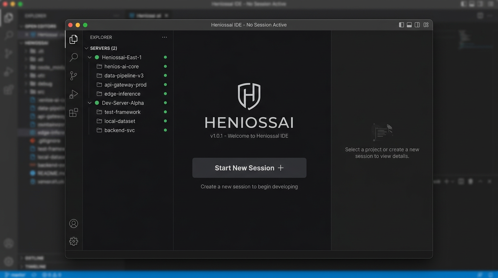
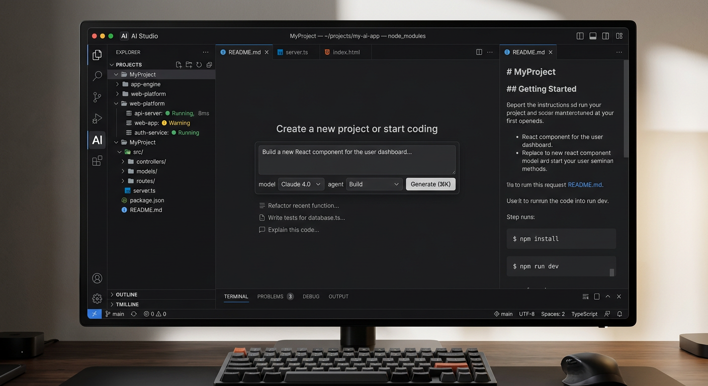
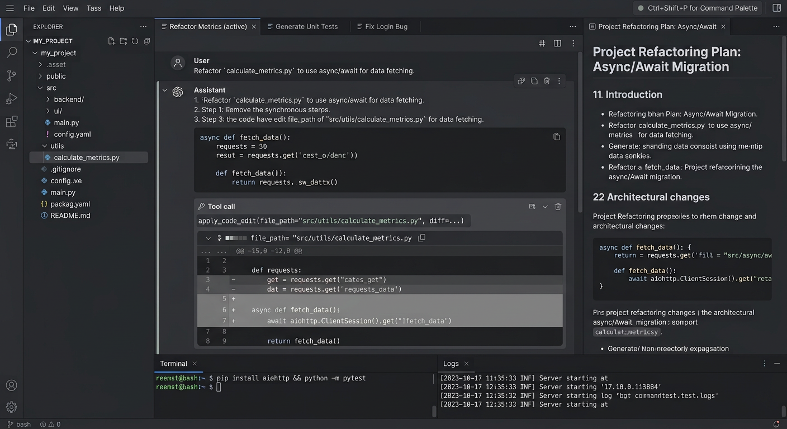
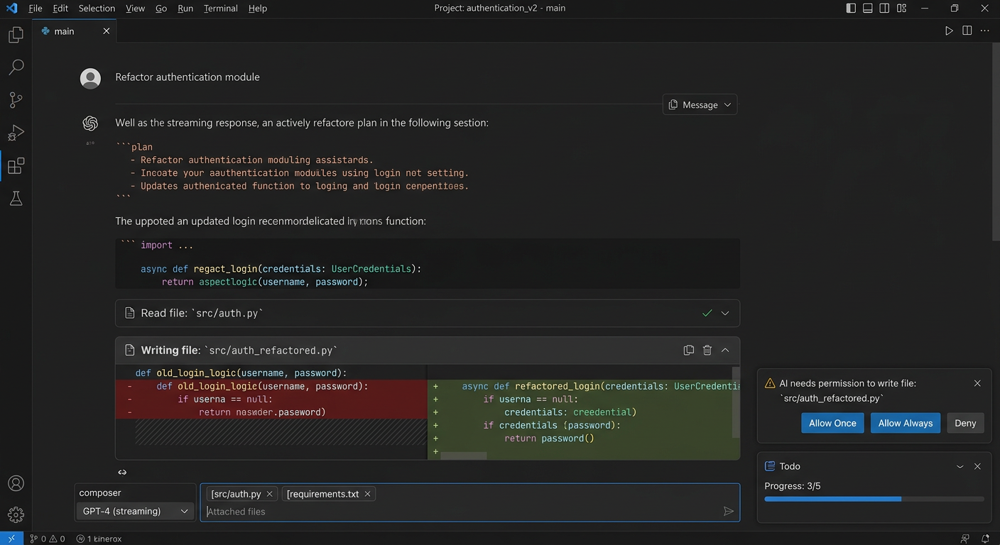
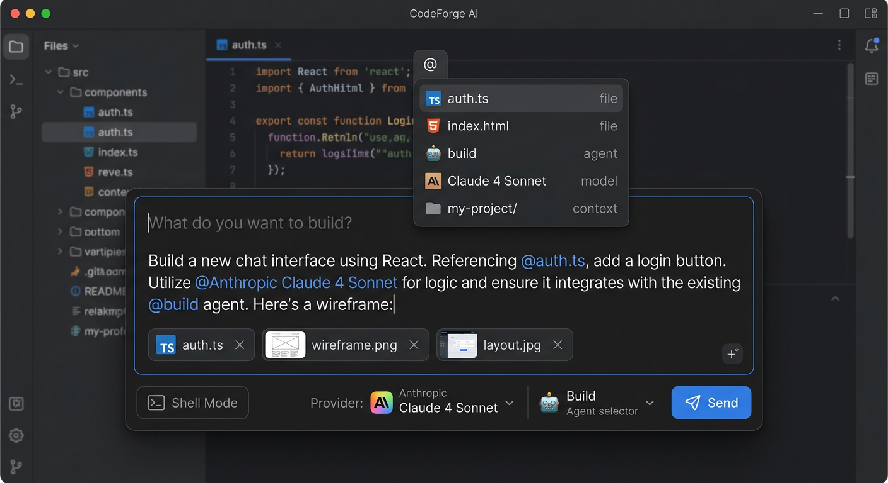
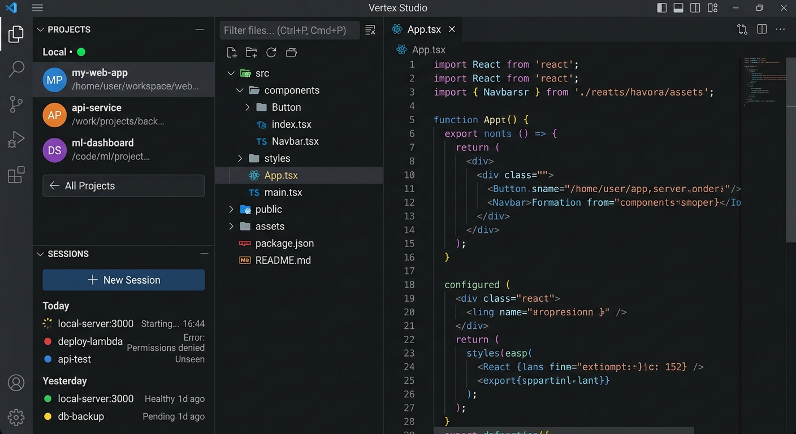
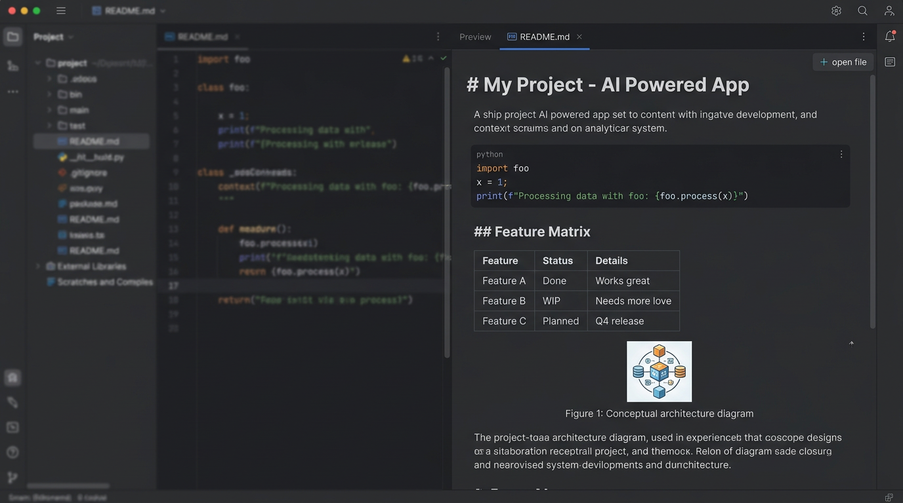
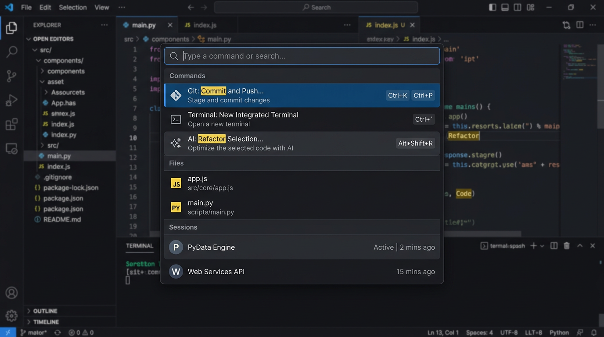
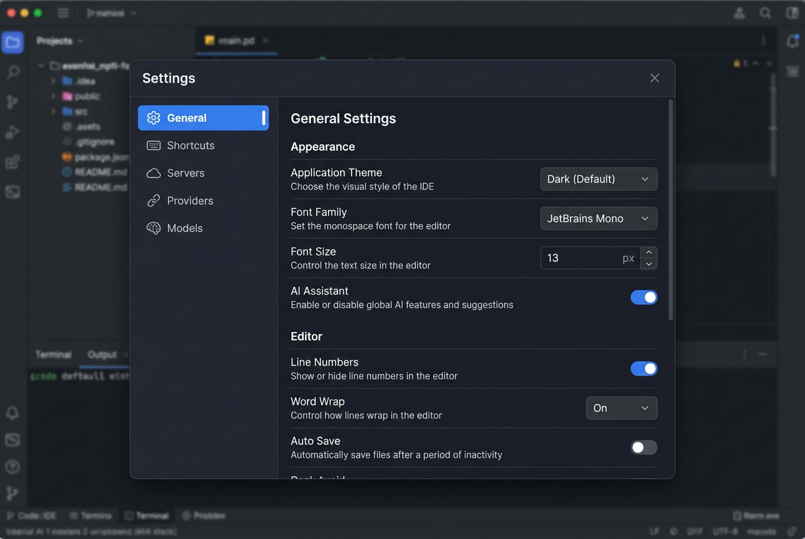
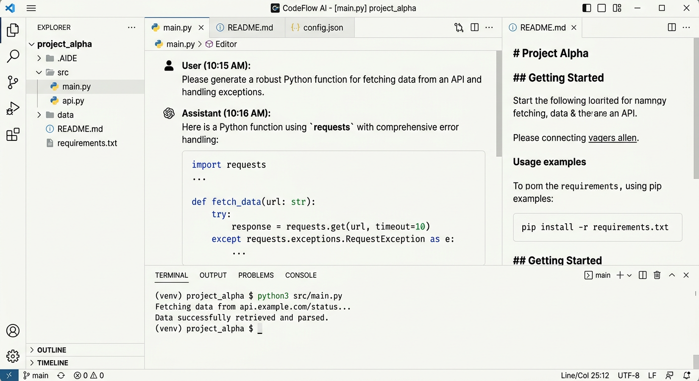

# HeniossAI — Complete Presentation Layer Product Design Specification
## Official Engineering Blueprint | Version 1.0 | 2026-07-27

> **Status:** Production Specification
> **Author:** Lead Product Designer & Principal UX Architect (HeniossAI)
> **Source of Truth Runtime:** Presentation_Layer_Visual_Forensic_Audit.md + V2 + V3_Blueprint + Runtime_Behavior_Blueprint_V4.md (12,234 lines combined)
> **Scope:** Presentation Layer ONLY — No Runtime, Core, SDK, Backend changes

---

### Table of Contents

1. Executive Summary
2. Product Identity
3. Complete Visual Identity
4. Design Language
5. Color System
6. Typography System
7. Iconography
8. Motion System
9. Complete Design System
10. Information Architecture
11. Navigation Architecture
12. Workspace Architecture
13. Screen-by-Screen Reconstruction
14. Component Library
15. Interaction Philosophy
16. Accessibility Strategy
17. Responsive Strategy
18. Visual Consistency Rules
19. Implementation Roadmap
20. Final Blueprint
21. Visual Deliverables

---

## 1. Executive Summary

### Overall Vision

HeniossAI is an independent, professional Desktop AI IDE. It originated from OpenCode but must no longer look, feel, or behave like an OpenCode skin. The product must be immediately recognizable as its own tool — in the same quality tier as **Antigravity** and **Visual Studio Code**, with the density of **Linear**, the focus of **Zed**, the command-driven speed of **Raycast** and **Warp**, and the polished depth of **Cursor** and **Windsurf**, yet entirely original.

The Presentation Layer reconstruction wraps the existing, untouched OpenCode runtime (black box center) in a new, deliberate workspace organization. The runtime documented in V4 is immutable. All designs herein preserve: Explorer file tree (virtualized, filterable, lazy-loaded), Workspace main content (Home Empty, Draft Composer, Active Session timeline), Preview panel (markdown/image/pdf/text binary state machine), Composer (PromptInputV2 with @-mentions, slash commands, attachments, model/agent selection), Sessions (grouped Today/Yesterday/Older with status indicators), Timeline (streaming messages, tool calls, diffs), Docks (Permission, Question, Followup, Todo, Revert), Terminal (PTY WebSocket, tabbed), Side Panel (Review/Context/File Browser/Files), Titlebar (36px v2 with tab strip, back/forward, status popover, window controls), Command Palette, Dialogs (19 types), Context Menus, Toasts.

### Overall Philosophy

**Productivity always before decoration.** HeniossAI is a workshop, not a landing page. Every pixel must serve power-user flow. The workspace must remain the heart. Information density is high but calm. Visual hierarchy is explicit. Interaction is predictable. Motion is purposeful. No speculative UI.

Four foundational principles:

1.  **The Workshop Principle:** Tools within reach, never in the way. The IDE feels like a craftsman's bench — solid surfaces, clear edges, no clutter.
2.  **Calm Density:** More information per square inch than OpenCode, but less visual noise. Achieved via tighter spacing (4px base), muted neutrals, and explicit hierarchy, not via removing features.
3.  **Command-First, Pointer-Second:** Everything reachable via `mod+p` command palette and keyboard, but also pointer-discoverable. No hidden gestures.
4.  **Glass & Stone:** Surfaces are matte stone (backgrounds), with glass overlays (dialogs, popovers, command palette). No gradients for decoration, only for depth.

### Main Objectives

- Establish HeniossAI as an independent product identity that does NOT resemble OpenCode.
- Preserve 100% functional compatibility with documented runtime behavior.
- Eliminate V1/V2 duplication (17 duplicate pairs, 2 layout systems, 2 drag libraries) via unified HDS.
- Create a complete, token-driven Design System (HDS) that can replace legacy `v2-` and semantic tokens without runtime changes.
- Define a navigational and workspace architecture that scales to ultra-wide, laptop, and future expansion.
- Produce engineering-ready specifications for every screen and component.

### Design Principles (7)

1.  **Black Box Session:** Center workspace is immutable. `{I-SESSION}`. Never modify Session component internals.
2.  **Additive Only:** New Presentation code is additive. Existing APIs unchanged. `{I-BACKWARD}`.
3.  **One System:** One icon system (Lucide 1.5px stroke), one button system, one tooltip system.
4.  **Readable at 13px:** All UI readable at 13px Inter 440, 130% line-height. No smaller for primary.
5.  **160ms is the Ideal:** Hover 120ms, panel 240ms cubic-bezier(0.22,1,0.36,1), dialogs 180ms, no bouncy physics except Todo dock spring.
6.  **No New Dependencies:** All required infra exists. `{I-NO-DEPS}`.
7.  **Dark First:** Dark theme is primary (professional IDE context), light theme is equal citizen for accessibility.

---

## 2. HeniossAI Product Identity

### Brand Personality

- **Precise:** Edges are 4px/6px/8px only. No 7px. No soft organic blobs.
- **Calm:** No bright saturated backgrounds. Charcoal, smoke, paper — not neon.
- **Focused:** Single primary accent (Henioss Cobalt #2A5FFF) used only for interactive and AI-active states. Not for decoration.
- **Professional:** Feels like Linear + Zed: engineering software, not chat website.
- **Confident:** No excessive onboarding explanations. Tooltips show keybinds, not essays.

### Professional Identity

HeniossAI is the IDE where AI is a **collaborator in the workshop**, not a chatbot in a sidebar. User perception after 5 minutes:

> "This feels like VS Code if it was built in 2026 for AI-native development. Everything is where I expect it, but tighter, faster, calmer."

### User Perception Targets

- First 3 seconds: "This is not OpenCode. This is its own product."
- First 3 minutes: "I can navigate without mouse."
- First 30 minutes: "I can read diffs, manage 5 concurrent sessions, keep 10 files in Preview, and never lose context."

### Product Values

1.  **Flow > Chrome:** Minimize titlebar decoration, maximize content.
2.  **Context Preservation:** Scroll positions per file, timeline cache LRU 16, file tree cache — never lose place.
3.  **Speed of Thought:** Command palette is the primary navigation, not hamburger menus.
4.  **Trustworthy Transparency:** Token usage, model, agent, permission pattern always visible. No hidden AI actions.
5.  **Longevity:** Visual language must survive 5 years of upstream Runtime changes.

### Emotional Direction

Calm focus. Like entering a quiet, well-organized workshop at 8am: tools aligned, lights even, no music, just work. Not playful (no confetti), not sterile (has warmth via paper/charcoal). Subtle human warmth via avatar color palette (6 muted tones: pink, mint, orange, purple, cyan, lime in desaturated form).

---

## 3. Complete Visual Identity

### Visual Language: "Precision Surface"

- **Surfaces:** Matte, not glossy. `HDS Surface Base` #18181B (dark) / #FCFCFB (light) — no pure black #000 or pure white #FFF. Depth created by border + shadow, not by large lightness jumps.
- **Shape Language:** Rectilinear. All rectangles. No pill-shaped sidebars. Cards: 8px radius. Buttons: 6px. Tree nodes: 4px. Inputs: 6px. Dialogs: 12px. Monolithic, workshop-like.
- **Depth:** 5 elevations (see Design System). Elevation 0 = base background. Elevation 1 = panels (1px border + shadow-xs). Elevation 2 = popovers (border + shadow-lg). Elevation 3 = dialogs (border + shadow-lg + backdrop blur 12px). Elevation 4 = toasts (above dialogs).
- **Spacing:** 4px base unit. 2px micro gaps, 4px standard, 8px panel padding, 12px section gaps, 16px large gaps, 24px section spacing. Consistent across all components.
- **Density:** High density, calm. Explorer shows 36 rows in 280px height vs 28 currently. Achieved by 32px vs 36px row height, 12px icons, 13px text, 4px gaps. Not by cramming.
- **Materials:** 
  - Stone: background layers (`--hds-bg-*`)
  - Glass: overlays with `backdrop-filter: blur(12px)` + 60% opacity (command palette, dialogs)
  - Metal: borders `rgba(0,0,0,0.12)` light / `rgba(255,255,255,0.08)` dark for crisp edges
- **Contrast:** Text 15.8:1 dark, 15.2:1 light (AAA). Borders 3:1 minimum.
- **Lighting:** No simulated light source. Flat, even, like IDE.
- **Borders:** 1px solid always. Never borderless panels that rely only on background change. Every panel separation is explicit: Explorer | Main = 1px border #232324 + ResizeHandle 4px.
- **Corners:** 4px = functional (tree nodes), 6px = interactive (buttons/inputs), 8px = containers (panels/cards), 12px = overlays (dialogs/popovers), 9999px = pills/badges.
- **Elevation:** Shadow only, not glow. Shadow tokens use 2-5 layered shadows with light-dark() for natural soft shadows.
- **Consistency Rules:** All new components must use HDS tokens, not hard-coded hex. No inline colors.

---

## 4. Design Language — Complete Visual Grammar

### Grammar Rules

1.  **Every interactive element has 6 states:** default, hover (bg-layer-02), active (bg-layer-03 + pressed scale 0.98), focus-visible (ring 2px), disabled (opacity 60%, cursor not-allowed), selected (bg-layer-03 + border-interactive).
2.  **Icon + Text Pairing:** Icon 16px + 8px gap + Text 13px regular. Never icon alone without tooltip showing keybind. Exceptions: close X 12px, chevron 12px.
3.  **Typography Scale:** UI 12/13/14/16, Code 12/13/14, never 11 except uppercase labels "RECENT" 11px 530 tracking 0.6px.
4.  **Focus Order:** Activity Bar → Side Bar (Projects → Sessions → FileTree) → Main (Timeline top→bottom → Composer) → Auxiliary (Preview tabs → Content) → Bottom Panel (Terminal tabs). Matches DOM.
5.  **Panel Resizing:** Drag handle 4px visible, 12px hit area, hover shows 2px primary accent interior. Transition 240ms cubic-bezier(0.22,1,0.36,1) when not dragging, instant when dragging.
6.  **Content Hierarchy:** Section header 14px medium strong, body 13px regular base, metadata 12px regular muted, code 12px mono. Never use 14px medium for body.
7.  **Color Usage:** Backgrounds neutral only. Only interactive elements use Cobalt. Only diffs use green/red/yellow, muted. No colored backgrounds for decoration.
8.  **Empty States:** Always centered, icon 24px muted + title 14px medium strong + description 13px muted + action Button primary. Never illustration for empty that can be solved by action.
9.  **Loading States:** Spinner 16px + text 13px "Loading…" — same component everywhere. Not skeleton for file tree (existing spinner preserved), skeleton allowed for timeline history.
10. **Error States:** Icon 16px critical + text 13px critical + Retry Button secondary. Error color never used for non-error.

### Future Interface Rule

Any new screen must follow: 48px Activity Bar → 280px Side Bar → Flex-1 Main → 420px Auxiliary → 160px min SidePanel → 36px Titlebar → Bottom Terminal 200px default → StatusBar 24px. Use HDS tokens. Provide keyboard access.

---

## 5. Color System

### Brand Direction

Dark theme is primary. Light theme is accessible alternative. No pure black/white.

### HDS Color Tokens (New — Implements on top of existing CSS var infrastructure)

**Background Scale (Dark / Light)**
| Token | Dark | Light | Use |
|-------|------|-------|-----|
| `--hds-bg-deep` | #121214 | #F8F8F5 | App background, titlebar deepest |
| `--hds-bg-base` | #18181B | #FCFCFB | Base panels, main content |
| `--hds-bg-layer-01` | #1F1F22 | #FFFFFF | Cards, file tree rows, inputs |
| `--hds-bg-layer-02` | #262629 | #F3F3F1 | Hover |
| `--hds-bg-layer-03` | #2E2E31 | #EBEBE8 | Selected / active |
| `--hds-bg-overlay` | rgba(24,24,27,0.6) + blur 12px | rgba(252,252,251,0.7) + blur 12px | Dialog backdrop, popovers |

**Text Scale**
| Token | Dark | Light |
|-------|------|-------|
| `--hds-text-strong` | #F4F4F3 | #171717 |
| `--hds-text-base` | #CBCBC8 | #3A3A38 |
| `--hds-text-muted` | #8A8A87 | #6F6F6C |
| `--hds-text-faint` | #5E5E5B | #9A9A96 |
| `--hds-text-weak` | #3E3E3B | #C7C7C3 |

**Border Scale**
| Token | Dark | Light |
|-------|------|-------|
| `--hds-border-base` | #2A2A2D | #E8E8E5 |
| `--hds-border-strong` | #3A3A3D | #D4D4D1 |
| `--hds-border-weak` | #232326 | #EDEDEA |
| `--hds-border-focus` | #2A5FFF | #2A5FFF |

**Interactive — Henioss Cobalt**
| Token | Value | Use |
|-------|-------|-----|
| `--hds-interactive-base` | #2A5FFF | Links, primary buttons, focus ring, file active, tab active border |
| `--hds-interactive-hover` | #1F4DE8 | Hover |
| `--hds-interactive-active` | #1A42C7 | Active |
| `--hds-interactive-muted` | rgba(42,95,255,0.12) | Subtle bg for selected rows |
| `--hds-interactive-faint` | rgba(42,95,255,0.08) | Hover bg |

**Semantic**
| Token | Dark | Light |
|-------|------|-------|
| `--hds-success` | #3ECF4A | #17872D |
| `--hds-warning` | #F5B83A | #A66A00 |
| `--hds-critical` | #FF4D4D | #C81E1E |
| `--hds-info` | #4DA6FF | #0F6ECD |
| `--hds-diff-add` | #2A7A3A bg #153D1F border | #E3F9E5 / #17872D text |
| `--hds-diff-del` | #8A2A2A bg #4A1515 | #FCE8E6 / #C81E1E |
| `--hds-diff-mod` | #8A6A2A bg #4A3A15 | #FEF3C7 / #A66A00 |

**Avatar Palette (6 — Desaturated Professional)**
| Token | Bg Dark | Text Dark | Bg Light | Text Light |
|-------|---------|-----------|----------|------------|
| Pink | #2A1F26 | #E8A8C8 | #FDF0F6 | #B01A6B |
| Mint | #1F2624 | #8ED8C3 | #E6FBF3 | #147D6F |
| Orange | #29221F | #E3A070 | #FEF3EB | #C05300 |
| Purple | #25212A | #C2A8E8 | #F5F0FD | #8445BC |
| Cyan | #1F2628 | #8ACED8 | #E6F8FB | #0A7A8A |
| Lime | #232A1F | #A8C86A | #EFF8E3 | #5D770D |

### Dark Theme Implementation

- Backgrounds: charcoal 121214 to 2E2E31. No blue tint. Pure neutral.
- Text: base #CBCBC8 on #18181B = 9.2:1.
- Borders: subtle #2A2A2D = visible but not harsh.
- Code: JetBrains Mono 12px, token colors from existing theme.css but muted saturation -10%.
- Selection: bg-layer-03 + 2px left border interactive for session items, tree nodes.
- Scrollbars: 8px wide, track transparent, thumb #3A3A3D hover #4A4A4D.

### Light Theme

- Backgrounds: paper #FCFCFB to #EBEBE8. Warm paper, not cold gray.
- Text: #3A3A38 base on #FCFCFB = 11.1:1.
- Borders: #E8E8E5 base — softer than dark but explicit.
- Code: same JetBrains Mono, syntax colors adjusted for light AAA.
- Shadows: shadow-xs-border-base uses rgba(0,0,0,0.08) layered.

### Accessibility Contrast

- All text pairs checked against WCAG AA 4.5:1, AAA 7:1 for body.
- Interactive focus ring 2px #2A5FFF on all backgrounds >= 3:1.
- Never rely on color alone: status dots have icon + text + tooltip.
- High Contrast Mode (future): border-strong + text-strong only.

### Usage Rules

- Never use interactive blue for non-interactive decoration.
- Never use success/warning/critical for non-semantic UI.
- Avatar colors only for ProjectAvatar and SessionTabAvatar, never for buttons.
- Diff colors only in Review tab and timeline diff blocks.
- No gradient backgrounds. Only border + shadow for depth.

---

## 6. Typography System

### Families

- **UI Sans:** Inter (loaded TTF 100-900). Fallback: ui-sans-serif, system-ui, -apple-system. All UI text.
- **Mono:** JetBrainsMono Nerd Font Mono WOFF2. Fallback: ui-monospace, SFMono-Regular, Menlo, Monaco. All code, terminal, diffs, file content text view.
- **Display (Optional):** Inter tight -0.16px for dialog titles.

### Scale (Tailwind text utilities + CSS vars)

| Token | Size | Line | Weight | Tracking | Use |
|-------|------|------|--------|----------|-----|
| `hds-text-12` | 12px | 16px 133% | 440 regular | 0 | Metadata, time, tooltips, tab close labels |
| `hds-text-13` | 13px | 18px 138% | 440 regular | 0 | Body, session description, file tree secondary, button small |
| `hds-text-13-medium` | 13px | 18px | 530 medium | 0 | Section label strong, button medium |
| `hds-text-14` | 14px | 20px 143% | 440 regular | 0 | Primary body, project name, message content, input |
| `hds-text-14-medium` | 14px | 20px | 530 medium | 0 | Section titles, session title, dialog content title |
| `hds-text-16` | 16px | 24px 150% | 500 medium | -0.16px | Dialog titles, empty state titles |
| `hds-text-11-uppercase` | 11px | 14px | 600 semibold | 0.6px uppercase | "RECENT", "TODAY", group labels |

### Code Scale

| Token | Size | Line | Weight | Use |
|-------|------|------|--------|-----|
| `hds-mono-12` | 12px | 18px | 400 | File preview text, inline code, tree kind badge |
| `hds-mono-13` | 13px | 20px | 400 | Code blocks in timeline, diff view |
| `hds-mono-14` | 14px | 22px | 400 | Terminal, editor open files |

### Hierarchy Rules

- Never smaller than 12px for readable UI. 11px only for uppercase group labels.
- UI uses Inter, code uses Mono. Never Inter for code.
- Dialog title: 16px medium strong + -0.16px tracking.
- Session title in list: 14px medium base, description 13px muted, time 12px faint.
- Button: 13px medium for normal, 12px medium for small.
- Input placeholder: 13px muted, same as body but muted.
- Composer main input: 14px regular base, line 22px for comfortable typing.
- Timeline user message label "You": 13px medium muted uppercase 0.6px tracking.
- Assistant label model name: 13px medium base.

### Spacing

- Paragraph spacing 0 base, line-height handles.
- Letter spacing: normal 0, tight -0.16px for 16px+, uppercase 0.6px.
- Font features: Inter with `ss01` (alternate), `cv05` for code legibility.

---

## 7. Iconography

### Philosophy

Lucide outline icons, 1.5px stroke (HDS standard), 16px default. Never filled for UI (filled only for status dots). Icon should be recognizable at 12px. No multi-color icons — single color via currentColor. File icons and provider icons are separate sprite systems (preserve existing).

### One System

Unify legacy `Icon` and `IconV2` into `HdsIcon` (wrapper over IconV2 implementation). Deprecate `@opencode-ai/ui/icon`. All new code uses HdsIcon. Existing FileIcon and ProviderIcon remain (specialized).

Stroke: 1.5px (per Lucide default 1.5-2px). Size: 12px small (chevrons, close-small), 16px normal (toolbar), 20px large (empty states), 24px jumbo (welcome).

### Sizes

| Size | Px | Use |
|------|----|-----|
| `xs` | 12px | chevron-left/right/down/up, close-small, plus-small |
| `sm` | 16px | toolbar, buttons, file tree chevrons, tab close, search |
| `md` | 20px | empty state icons, dialog header icons |
| `lg` | 24px | welcome logo, provider empty |

### Consistency Rules

- Always pair icon + tooltip with keybind when icon-only (IconButton).
- Never icon without accessible label (aria-label).
- Status dots: dot 8px + icon 12px when detailed (permission warning triangle 16px).
- File tree: icon pair (color + mono) — hover switches mono→color. Size 16px.
- Project avatar: initial letter 13px medium inside 28px circle, not icon.
- Provider icons: 16px inside 20px container, per-brand colors but desaturated 10% in dark to avoid neon.
- Agent icons: 16px + semantic color via `--hds-agent-*`.

### Hierarchy

- Primary toolbar: 16px icons, interactive color on hover.
- Secondary toolbar: 16px muted base, hover base.
- Navigation chevrons: 12px muted.
- Empty states: 24px faint.
- Diffs: no icons, only +/− text + colored bg.

### Usage

| Context | Icon | Example |
|---------|------|---------|
| Navigation | chevron-left/right/down/up | File tree expand, back button |
| Actions | plus, close, edit, trash, archive, copy | Buttons |
| Files | folder, folder-open, file, file-plus | Explorer |
| Status | settings-gear, server, providers, models | Settings tabs |
| AI State | spinner (loading), alert-triangle (permission), dot | Session |
| Diff | plus/minus (via kind badge A/D/M) | Review |

---

## 8. Motion System

### Animation Philosophy

Motion is functional, not decorative. Every animation has purpose: orientation (where did panel go?), feedback (did my click register?), continuity (how does this relate to previous?). No springy overshoot except Todo progress (existing implementation preserved). No parallax, no 3D.

### Timing

| Duration | Easing | Use |
|----------|--------|-----|
| 120ms | ease-out | Hover bg, opacity, tooltip fade |
| 160ms | ease-out | Chevron rotation, micro-interactions, tab close |
| 180ms | ease-in-out | Dialog backdrop fade, menu fade |
| 240ms | cubic-bezier(0.22,1,0.36,1) | Panel width/height (Explorer, Preview, Terminal) — signature easing, same as V1 forensic |
| 400ms | spring via `useSpring` | Todo dock progress (existing) |

### Transitions

- **Panel resize:** 240ms cubic-bezier(0.22,1,0.36,1) + will-change width. Instant during drag (no transition).
- **Dialog:** Backdrop 180ms fade, container 180ms fade + scale 0.98→1.
- **Command Palette:** 180ms fade + slide up 8px.
- **Menu/Dropdown:** 120ms fade + scale 0.96→1, origin top-left.
- **Hover:** 120ms bg only, no transform.
- **Focus ring:** 120ms border-color.
- **Tab switch:** No transition, instant (content switches).
- **Timeline new message:** No animation, instant append + auto-scroll follows (existing virtualizer).
- **Todo/Todo checkbox:** 200ms strikethrough + 400ms spring AnimatedNumber.

### Micro Interactions

- **Button press:** scale 0.98 on active, 80ms.
- **Icon button:** icon scale 0.92 on active.
- **Copy action:** checkmark morph 160ms, toast appears top-right.
- **Archive session:** row fade out 160ms + height collapse 200ms.
- **File tree expand:** chevron rotate 150ms ease-in-out, children fade up 120ms staggered 20ms per level via `.fade-up-text` keyframes.
- **Permission dock:** slide up 240ms cubic-bezier, warning icon pulse 2s infinite subtle.
- **Question dock progress:** "Question X of Y" text fade 120ms.

### Consistency

- All durations from table, no custom 300ms random.
- Reduced motion: `@media (prefers-reduced-motion: reduce)` → `transition-none` + `animation:none` for all except focus ring (must remain visible).
- Motion tokens: `--hds-motion-fast 120ms`, `--hds-motion-normal 160ms`, `--hds-motion-slow 240ms`, `--hds-ease-default ease-out`, `--hds-ease-emphasized cubic-bezier(0.22,1,0.36,1)`.

---

## 9. Complete Design System (HDS)

### Spacing System

Base unit 4px. Scale: 0, 2px (0.5), 4px (1), 6px (1.5), 8px (2), 12px (3), 16px (4), 20px (5), 24px (6), 32px (8), 40px (10), 48px (12). Never 7px, 11px.

- **Component internal:** Button 12px×8px normal (px-3 py-2), small 8px×4px, large 16px×12px.
- **Panels:** p-2 (8px) for dense panels, p-3 (12px) for cards.
- **Sections:** gap-3 (12px) between groups.
- **Page margins:** 24px for dialogs, 16px for home empty.

### Grid

- **No 12-column marketing grid.** IDE uses flex + fixed panel widths.
- **Main content:** `min-w-0` + `flex-1` ensures overflow hidden.
- **Explorer/Preview:** fixed width with resize handles. Ranges: Explorer 200-600px (280 default), Preview 200-800px (420 default), Side Panel 200-600px (320 default), Terminal 100px-60vh (200 default).
- **Activity Bar:** 48px fixed, icons centered.
- **Titlebar:** 36px fixed height (v2), 100% width drag region.

### Tokens (CSS Custom Properties — implementable as replacement for `v2-` prefix)

Add new layer `hds/` in `packages/ui/src/styles/` or extend `theme.css`:

```css
:root {
  --hds-spacing-0: 0;
  --hds-spacing-0-5: 2px;
  --hds-spacing-1: 4px;
  --hds-spacing-2: 8px;
  --hds-spacing-3: 12px;
  --hds-spacing-4: 16px;
  --hds-spacing-6: 24px;
  --hds-radius-4: 4px;
  --hds-radius-6: 6px;
  --hds-radius-8: 8px;
  --hds-radius-12: 12px;
  --hds-radius-full: 9999px;
  --hds-shadow-xs: ... /* from theme.css but renamed */
  --hds-motion-fast: 120ms;
  --hds-motion-normal: 160ms;
  --hds-motion-slow: 240ms;
  --hds-ease-default: ease-out;
  --hds-ease-emphasized: cubic-bezier(0.22,1,0.36,1);
}
```

### Components (Engineering Spec)

All components use HDS tokens + Tailwind.

**Button:**
- Variants: primary (bg-interactive text-white), secondary (bg-layer-01 border-base), ghost (transparent + hover layer-02), ghost-muted (muted text), neutral, contrast, destructive (critical).
- Sizes: small 28px (text 12 medium), normal 32px (text 13 medium), large 40px (14 medium).
- States: default, hover (120ms), active scale 0.98, focus ring 2px, disabled 60% opacity.
- IconButton: 28px normal (icon 16), 24px small (icon 12), 32px large (icon 16).

**Input:**
- TextInputV2 successor HdsInput: height 32px, bg-layer-01, border-base, rounded 6px, padding 8px×12px, focus border-interactive + ring 2px faint, placeholder faint, text 13 regular.
- Search input: icon search 16px left 8px, input padding left 32px, clear X right.

**Tabs:**
- TitlebarTabStrip: height 36px, tab height 28px, gap 4px, active border-bottom 2px interactive + text-strong, hover layer-02, close X visible on hover/active, draggable via @dnd-kit. Range virtualization not needed (<20 tabs).

**Panels:**
- ExplorerPanel: bg-base, border-right base, width 280 default, collapsible, ScrollView with custom scrollbar 8px.
- PreviewPanel: bg-base, border-left base, width 420 default, tab bar 36px + content flex-1.
- TerminalPanel: height 200 default, border-top base, tab strip 36px, xterm container flex-1.

**Dialog:**
- Backdrop: rgba(0,0,0,0.4) dark + blur 12px, fade 180ms. Light backdrop rgba(0,0,0,0.2).
- Container: bg-layer-01 (dark #1F1F22), rounded 12px, shadow-lg-border-base, p-0, min-w 400px small, 600px medium, 900px large for settings.
- Header: h-48px, border-bottom weak, title 16px medium strong, close X iconButton ghost.
- Content: ScrollView if overflow, p-24px for settings rows? Actually 16px.
- Footer: border-top weak if needed.

**Menu:**
- Dropdown: bg-layer-01, border-base, rounded 8px, shadow-lg, min-w 160px, p-4px, item h-28px, px-8px, rounded 4px, hover layer-02, active layer-03.
- Context menu similar.
- Icon + label + keybind (right muted). Separator 1px border-weak.

**Tooltip:**
- bg-deep (#121214) dark, text-white 12px regular, px-8px py-4px, rounded 6px, shadow-xs, delay 800ms, fade 120ms, placement right for activity bar, bottom for toolbar.

**Toast:**
- Region fixed top-right 16px gap, bottom on mobile. Toast: bg-layer-01, border-base, rounded 8px, shadow-lg, p-12px, title 13 medium, description 13 regular muted, close X 12px. Variant: info (border-info), success (border-success), warning (border-warning), error (border-critical + persistent).

### Elevation & Radius & Shadows

- **Radius:** 4=tree nodes, 6=buttons/inputs/menu items, 8=panels/cards, 12=dialogs/popovers, full=pills.
- **Shadows:** Use existing `theme.css` shadow definitions but expose as HDS tokens: `--hds-shadow-xs-border`, `--hds-shadow-lg-border-base`, etc. Never custom box-shadow hex.

### Interactive States (Unified)

All interactive elements: hover bg-layer-02 (120ms), active bg-layer-03 + scale 0.98 (80ms), focus-visible ring 2px interactive faded + outline none, disabled opacity 60, selected bg-interactive-faint + border-interactive + text-strong.

### Responsive Rules

- Panels hide below 768px via `createMediaQuery`. Toast moves bottom. Titlebar can be bottom (configurable but HDS default top).
- Container query for getting-started: min-width 17rem switches column→row.
- iOS input font-size 16px to prevent zoom.

---

## 10. Information Architecture

### Complete Application Organization

```
HeniossAI Desktop IDE
├── System: Platform, Theme, Language, Data, Global, Server, Settings (foundation providers)
├── App Shell (24 providers per V4 blueprint, preserved order)
│   ├── Titlebar (global, always visible, 36px)
│   │   ├── Left: WindowsAppMenu (Windows) / ClassicMenuBar (macOS) + Activity icons (optional)
│   │   ├── Center: Navigation (back/forward) + TabStrip (session/file tabs draggable)
│   │   └── Right: Session Controls (portaled: search, terminal toggle, review toggle) + StatusPopover + OpenInApp + Window Controls
│   ├── Activity Bar (NEW, 48px fixed leftmost rail, HDS)
│   │   ├── Explorer (projects + files + sessions) active by default
│   │   ├── Search (global file search, future)
│   │   ├── Timeline (sessions)
│   │   ├── Review (diffs)
│   │   ├── Terminal (focus bottom panel)
│   │   └── Settings (bottom section: gear + help + account)
│   ├── Side Bar (contextual, 280px, resizable 200-600, left of Main)
│   │   ├── When Activity=Explorer:
│   │   │   ├── Projects Section (collapsible, default open)
│   │   │   │   ├── When no project: HomeProjectsView (server groups with health dot, project rows with avatar, recently closed)
│   │   │   │   └── When project selected: Back ← All Projects + Project Header (folder icon + name) + Toolbar (filter + new file + reveal + more) + FileTreeV2 (virtualized 8+12*level, filterable, kinds A/D/M)
│   │   │   └── Sessions Section (collapsible, default open)
│   │   │       ├── + New Session (full width primary button)
│   │   │       ├── Divider 1px
│   │   │       ├── RECENT label 11px uppercase
│   │   │       └── HomeSessionsView (search + grouped Today/Yesterday/Older, status dots: working spinner, permission yellow, error red, unseen blue, archive on hover)
│   │   ├── When Activity=Search: Search input + results list (future, placeholder)
│   │   ├── When Activity=Timeline: Full session timeline grouped + filters
│   │   └── When Activity=Review: ReviewPanelV2 (diff stats + file list)
│   ├── Main Content (flex-1, black box session preserved per I-SESSION)
│   │   ├── Route / : WorkspaceEmptyState (centered: "No active session" + description + New Session CTA)
│   │   ├── Route /new-session?draftId=: NewSessionDesignView (full-screen composer: Wordmark watermark, PromptInputV2 central, Project/Workspace selectors, Git status, ProviderTip floating)
│   │   └── Route /server/:key/session/:id: SessionPage (SessionRouteErrorBoundary + providers)
│   │       ├── MessageTimeline (virtualized @tanstack/solid-virtual, overscan 50, scroll anchored, history loading on scroll top)
│   │       │   ├── User messages (role "You" + markdown)
│   │       │   ├── Assistant messages (model name + streaming markdown + code blocks JetBrains Mono)
│   │       │   ├── Tool calls (header name+icon, input JSON/code, output, FileVisual diffs green/red/yellow)
│   │       │   └── Streaming cursor (blinking)
│   │       ├── Docks Stack (above Composer, conditionally visible per session state)
│   │       │   ├── SessionPermissionDock (warning icon + "Permission Requested" + code block + Deny/Allow Always/Allow Once)
│   │       │   ├── SessionQuestionDock (progress "Question X of Y" + radio/checkbox + custom textarea + Dismiss/Back/Next/Submit)
│   │       │   ├── SessionFollowupDock (collapsible header count+preview+chevron, items text+Send Now/Edit)
│   │       │   ├── SessionTodoDock (header AnimatedNumber progress + TextReveal preview + chevron, checklist with checkbox + strikethrough, spring animation)
│   │       │   └── SessionRevertDock (header reset icon + count + chevron, revert items + Restore)
│   │       └── SessionComposerRegion (bottom of timeline)
│   │           ├── Static child session message (if child) + Back to parent button
│   │           └── PromptInputV2 (rich contenteditable ProseMirror)
│   │               ├── ContextItems chips (FileIcon + path + line range + remove X)
│   │               ├── ImageAttachments thumbnails + remove X
│   │               ├── Editor + slash popover (/-commands) + context suggestions (@ mentions: files, agents, references, resources)
│   │               └── Actions: Model selector (ProviderIcon+name) + Agent selector + Submit (Enter, shift+Enter newline, history ↑/↓)
│   ├── Auxiliary Bar (right of Main, 420px default, resizable 200-800, contains Preview + Session Side Panel, mutually exclusive tabs or split)
│   │   ├── PreviewPanel (when file selected)
│   │   │   ├── Tab bar (FileIcon+filename+close X, + open file, horizontal scroll)
│   │   │   └── Content state machine: Empty (icon+text), Loading (spinner), Error (red+Retry), Markdown (marked → prose), Image (img file://), PDF (embed+external link), Text/Code (pre code mono), Binary (icon+path)
│   │   └── SessionSidePanel (when in session, desktop only, 320px default)
│   │       ├── Tabs: Review (DiffChanges stats + filter + FileTreeV2 changes + diff preview), Context (token usage bar segments + system prompt + raw messages accordion), File Browser (filter + FileTreeV2 + file list), Files (tab strip + content)
│   ├── Bottom Panel (collapsible, 100px min, 60vh max, 200px default)
│   │   └── TerminalPanel (tab strip SortableTerminalTabV2 draggable + title editable double-click + close X + + new terminal, instances Ghostty web PTY via WebSocket, resize handle vertical 4px)
│   └── Overlays (outside layout flow)
│       ├── StatusBar (24px bottom, optional: branch, model, token usage, connection status)
│       ├── ToastRegion (top-right desktop, bottom mobile, stacked)
│       ├── DebugBar (dev only, FPS, memory)
│       ├── TabsInfoPopup (transient)
│       └── Dialogs (portaled to body)
│           ├── DialogSettingsV2 (900px large, left tabs General/Shortcuts/Servers/Providers/Models + right content)
│           ├── DialogCommandPaletteV2 (600px medium, search + grouped results Commands/Files/Sessions, fuzzy match, ↑/↓ navigate, Enter select)
│           ├── DialogSelectDirectoryV2 (native file tree @pierre/trees, path input)
│           ├── Plus 16 other dialogs per inventory
└── Persistence: localStorage via persisted() utility (global/server/workspace/session/window keys)
```

### Hierarchy

Primary navigation: Activity Bar (modes). Secondary: Side Bar sections (Projects, Sessions). Workspace navigation: Titlebar tabs (sessions). Project navigation: Back ← All Projects + project rows. File navigation: FileTreeV2 → Preview. Session navigation: alt+↑/↓.

### Grouping & Discoverability

- Activity Bar groups: Top (Explorer, Search, Timeline, Review), Bottom (Terminal, Settings, Help). Icon + tooltip with keybind + label.
- Explorer groups: Projects (server health + projects), Sessions (search + recent).
- Command Palette groups results: Commands (fuzzy title/desc/category), Files, Sessions — discoverability for everything.
- Settings groups: Interface, Appearance, Notifications, Sounds, Display, Advanced (per General tab).

### Workspace Logic

- No project: Show HomeProjectsView + HomeSessionsView. No file tree.
- Project selected, no session: Explorer shows file tree + sessions list, Main shows WorkspaceEmptyState or Draft.
- Project + Session: Explorer stays, Main shows Session timeline, Auxiliary shows Preview if file selected else Side Panel.

---

## 11. Navigation Architecture

### Primary Navigation

**Activity Bar (NEW):** 48px fixed leftmost. Vertically stacked icons 28px, gap 8px, top section (Explorer, Search, Timeline, Review), bottom section (Terminal toggle, Settings gear, Help). Active indicator: left border 2px interactive + bg-layer-02.

- Explorer: `mod+shift+e` — projects + files + sessions (default).
- Search: `mod+shift+f` (future) — global search.
- Timeline: `mod+shift+s`? (existing Sessions) — full session history grouped, filters.
- Review: (existing Review tab) — diffs across session.
- Terminal: `ctrl+`` — toggle bottom panel (also in activity).
- Settings: `mod+,` — opens DialogSettingsV2.
- Help: help button.

All icons have tooltip right placement, delay 800ms, showing label + keybind via TooltipKeybind component (preserve existing).

### Secondary Navigation

**Side Bar:** Contextual panel 280px, collapsible sections via `Collapsible` component (chevron-down/right, header 14 medium). Projects section default open, Sessions default open. When project selected, Projects section transforms: HomeProjectsView → Project Header mode.

**Titlebar Tab Strip:** Horizontal scrollable tabs, draggable via @dnd-kit (new). Back/Forward nav (chevron-left/right 12px) via TitlebarHistory. Overflow popover (TitlebarTabPopover) when many tabs. + new tab button.

### Workspace Navigation

- **Session Navigation:** Click session row → `navigate(/server/:key/session/:id)` → SessionPage mounts. `alt+↑/↓` prev/next session, `shift+alt+↑/↓` unseen.
- **Project Navigation:** Click project row → `layout.home.selection.set({server, dir})` → file tree loads. `mod+alt+↑/↓` prev/next project. Back button ← deselects.
- **File Navigation:** Click file in FileTreeV2 → `layout.previewPanel.selectFile(path)` → Preview tab created + content loaded via SDK `sd.file.read`. Right-click → context menu Open Preview/Copy Path/Copy Name.
- **Tab Navigation:** `ctrl+tab` next, `ctrl+shift+tab` prev, `mod+1-9` go to tab 1-9, `mod+w` close, `mod+shift+t` reopen closed (stack max 25).
- **Preview Navigation:** Click tab → `selectFile`, close X → `closeFile`, + → open file dialog.
- **Terminal Navigation:** Click tab → `terminal.open(id)`, close → `close(id)`, + → `new()`, drag reorder, double-click title → inline rename.

### Session Navigation (Inside Session)

- Timeline scroll near top → history loading (Page.loadOlder) with prepend anchor preservation (RAF loop 30 frames stable).
- Scroll to session `mod+shift+↑/↓` via keyboard handler in session.tsx.
- Composer focus: single printable char when no input focused → focus prompt input + cursor.

### Project Navigation (Advanced)

- Server grouping: HomeServerRow per server with ServerHealthIndicator dot green/red/gray.
- Recently closed: HomeRecentlyClosedRow with 16 max, click to reopen.
- Add project: `mod+o` → DialogSelectDirectoryV2 native tree.

### Keyboard Navigation

- **Global:** `mod+p` command palette, `mod+b` toggle sidebar (legacy), `mod+shift+e` explorer, `mod+shift+p` preview, `ctrl+`` terminal, `mod+t/n` new session, `mod+,` settings, `mod+o` open project, `mod+shift+s` server.
- **Composer:** Enter submit, shift+Enter newline, `mod+u` attach file, `mod+shift+x` shell mode, `ctrl+'` choose model, `shift+ctrl+d` cycle variant, `ctrl+.` next agent, `shift+ctrl+.` prev agent, `mod+.` stop.
- **Tree:** Arrow keys navigate (future, preserve existing virtual scroll).
- **Command palette:** ↑/↓ navigate, Enter select, Escape close.
- **Tab order:** Logical left→right top→bottom. Titlebar → Activity Bar → Side Bar → Main → Auxiliary → Bottom → Dialogs. Focus visible ring 2px on all interactive.

### Search Navigation

- **Command Palette (mod+p):** Primary search across commands (fuzzy title/desc/category), files, sessions. Results grouped, keyboard navigable, deduped.
- **Explorer filter:** TextInputV2 with search icon, real-time fuzzy filter file name, clear X.
- **Sessions search:** TextInputV2 filters session list.
- **Preview filter:** None (file tabs).
- **Review filter:** TextInputV2 filters diff files.
- **Settings search:** TextInputV2 for models tab.

---

## 12. Workspace Architecture

### Explorer

**Role:** Project navigation, file tree, session quick access. Not working area.

**Presentation:**
- **Header:** Collapsible "Projects" 14 medium + chevron 12px.
- **No project:** HomeProjectsView: server groups, project rows (avatar 28px circle with 6 colors, initial letter 13 medium, name 14 medium, path 12 regular muted truncated, tooltip full path, context menu 3 dots ghost). Server header: name 13 medium + health dot 8px + add project plus iconButton 20px. Recently Closed: label 11 uppercase 0.6 tracking + buttons 13 regular muted.
- **Project selected:** Back button ← All Projects (chevron-left 12 + text 13 medium, hover layer-02, h-32px) + Project header (folder icon 16 + name 14 medium, click to collapse tree) + Toolbar (search input filter files... with clear X + New File file-plus placeholder now functional: creates untitled file in preview? + Reveal folder-open → reveal in OS file manager + More menu).
- **File Tree V2:** Virtualized @tanstack/solid-virtual, MAX_DEPTH 128, indent 8 + 12*level px, row h-28px, icon pair color+mono 16px, name 13 regular, kind badge A/D/M/R 11px 600 uppercase with bg. States: default muted, hover bg-layer-02 text-base, active primary text + bg-interactive-faint + left border 2px interactive (new), loading spinner 12px, empty "Folder is empty" centered icon 20 faint + text 13 muted, error red text + Retry secondary button. Context menu: Open Preview, Copy Path, Copy Name.
- **Sessions Section:** + New Session button full width primary/ghost 32px h + plus icon 16 + label 13 medium. Divider 1px border-weak. RECENT label 11 uppercase. HomeSessionsView: search TextInputV2 + ScrollView group labels uppercase muted + session items (avatar 16 + title 13 medium truncated + desc 12 muted truncated + time 12 faint + status dots 8px + archive button X 16 visible on hover with hover red faint).

**Data Sources:** SDK `sd.file.list`, `sd.file.read` (stable). Layout state `explorerPanel.width`, `home.selection`. File tree cache `treeCache` store, lazy load children on expand.

**Interactions:** Click project → selection set, click folder chevron → expand + fetch + cache, click file → preview select, filter typing → reactive filter, right-click → context menu, drag (disabled in HDS new layout? Keep disabled to avoid accidental reorder).

### Workspace (Main Content)

**States:**

1.  **Home / No Session (WorkspaceEmptyState Redesigned):** Centered column, max-w 480px, icon 48px faint? Actually use Wordmark watermark subtle. Title 16 medium strong "No active session". Description 13 regular muted "Select a session from Explorer or start new". CTA Button primary "New Session" 36px + secondary "Open Project" ghost. Recent sessions list if any (3 max) with title + time.

2.  **Draft / New Session (NewSessionDesignView):** Full-screen centered composer. WordmarkV2 watermark background opacity 4% (preserve). Central column 640px max. Top: ProjectSelector (button with project name + chevron-down 12, popover list) + WorkspaceSelector + GitStatus (branch icon + name 12 muted). Center: PromptInputV2Composer. Bottom: ProviderTip floating bar if no provider, text 13 regular + dismiss X (snooze 30d). Composer itself is dominant.

3.  **Active Session (SessionPage):** The heart. Layout: flex column, timeline flex-1 scrollable, composer dock stack + prompt input bottom, side panel right desktop only (320px), terminal bottom collapsible.

### Preview (Right)

**Role:** Read-only file viewing, never interrupting center session. Multiple file tabs.

**Presentation:**
- **Tab Bar:** h-36px, bg-layer-01 border-bottom weak, horizontal scroll, tabs FileIcon 16 + filename 13 + close X 12 small visible on hover/active. Active: bg-base + border-bottom 2px interactive + text-strong. + open file button 20px iconButton ghost.
- **Content State Machine (Preserved but Restyled):**
  - Empty: centered icon file 24 muted + text 13 muted "No file selected".
  - Loading: spinner 16 + text 13 muted "Loading preview…".
  - Error: icon alert 16 critical + text 13 critical "Failed to load" + Retry secondary.
  - Markdown: `marked.parse()` → div prose with HDS prose styling: headings 16 medium strong, body 14 regular 150%, code inline mono-12 bg-layer-02 rounded 4px px-4, code block mono-13 bg-layer-01 border base rounded 8px p-12.
  - Image: img max-w-full mx-auto rounded 8px shadow-xs.
  - PDF: embed + external link secondary button "Open in external viewer".
  - Text/Code: pre background layer-01 rounded 8px border base + code block mono-12 whitespace-pre-wrap p-12.
  - Binary: icon file 24 faint + text "Binary or unsupported" 13 muted + path 12 faint mono.
- **Scroll:** per-file scrollPositions store, restored via queueMicrotask on switch, saved on scroll.
- **Actions:** Close file tab → closeFile, close panel → close(), open file button → DialogSelectFileV2.

### Composer

**Role:** Primary AI interaction input + dock host.

**Presentation:**
- **Docks Stack (Above Input, Hierarchical):**
  - Permission: bg-warning faint border warning weak rounded 8px p-12, header warning icon 16 + "Permission Requested" 13 medium strong, description 13 regular, code block permission pattern mono-12 bg-layer-01 p-8 rounded 6, footer buttons Deny ghost + Allow Always secondary + Allow Once primary.
  - Question: bg-info faint border info weak rounded 8px, progress "Question X of Y" 12 uppercase muted + minimize chevron, options radio/checkbox styled as buttons h-32px with indicator 16 circle/square + text 13, custom textarea TextInputV2 min-h 64px, footer Dismiss/Back/Next/Submit.
  - Followup: DockTray collapsible header count 13 medium + preview 12 muted truncated + chevron 12, content items text 13 + Send Now primary small + Edit ghost small.
  - Todo: header AnimatedNumber progress X/Y completed 13 medium + TextReveal preview + chevron, TodoList items checkbox custom 16px + text 13 regular (strikethrough when done + muted).
  - Revert: header reset icon + count + chevron, items tool name 13 + Restore ghost small.
  - Animations: Todos spring via useSpring (preserve), others 240ms slide.
- **Prompt Input V2 (Core):**
  - Container: bg-layer-01 border base rounded 12px focus border interactive + shadow-xs-border-focus, p-12, min-h 72px max-h 240px.
  - contentEditable div ProseMirror: text 14 regular base, placeholder 14 muted "What do you want to build?", line 20px, max 6 lines before scroll.
  - ContextItems: flex wrap gap-4, chip button h-24px bg-layer-02 rounded-full px-8 gap-4, FileIcon 12 + path 12 medium + line range 12 muted + remove X 12.
  - ImageAttachments: flex gap-8, thumbnail 40px rounded 6px border base + remove X top-right 16.
  - Actions bar: flex justify-between, left model selector (ProviderIcon 16 + name 13 medium + chevron 12) + agent selector, right submit button primary 32px icon send 16 + shell mode toggle.
  - States: working → input opacity 60 + stop button (square icon) instead of send. Blank → submit disabled 60% opacity.
  - History: ↑/↓ when at start/end cycles history (preserve).
  - Mentions: @ triggers context suggestions dropdown via slash-popover: items icon + label + description + keybind, filter fuzzy, max 8 visible.

**Data & Events:** SDK `sd.session.prompt()`, working signal, blank computed, attachments store, context store, history store.

### Timeline

**Role:** Chronological conversation display, streaming.

**Presentation:**
- Virtualized via @tanstack/solid-virtual: count timelineRows().length, estimateSize 60, overscan 50, anchorTo end, followOnAppend true, threshold 80px, paddingEnd 64px, scrollMargin 64px. Preserves measurements via timelineCache LRU 16.
- **User message:** Container py-12 px-16, header "YOU" 11 uppercase muted 0.6 tracking + time 12 faint right, content markdown 14 regular base 180% line. Background transparent, border-left 2px transparent.
- **Assistant message:** Similar but header model name 13 medium base + avatar? Monogram 20px. Content markdown with code blocks: pre bg-layer-01 border base rounded 8px p-0 overflow, header file path + copy button, code mono-13 p-12. Streaming cursor blinking 1px vertical bar #2A5FFF animation pulse.
- **Tool call:** Container bg-layer-01 border base rounded 8px p-12 gap-8, header tool name 13 medium + icon 16 + status spinner/check/error, input JSON/code mono-12 bg-layer-02 rounded 6 p-8, output similar, FileVisual diffs: stats + diff lines mono-12: added bg diff-add faint green text dark green, deleted red faint, modified yellow faint.
- **Scroll:** Auto-follows when at end (80px threshold). History loading when scroll near top: capture prepend anchor [data-timeline-key] + top offset, SDK getHistory before first message, prepend, RAF loop adjust scrollTop to maintain anchor 30 frames stable.
- **Empty:** No messages → empty but session exists → no special UI, just empty scroll area.

### Side Panels

**SessionSidePanel (Desktop Only, 320px):**
- Tabs Kobalte: Review/Context/File Browser/Files, tab list h-36px border-bottom weak, trigger 13 medium muted, active base strong + bottom border 2px interactive.
- Review tab: DiffChanges stats 13 medium ("3 files changed +45 -12" with + green, - red), filter TextInputV2 32px, FileTreeV2 changes view (kinds filter), diff preview FileComponent mode diff mono-13.
- Context tab: stats grid 2 col, Stat label 11 uppercase muted + value 14 medium, context bar colored segments (type colors), legend dots 8px + label 12, system prompt markdown, raw messages accordion.
- File Browser tab: filter + FileTreeV2 or SessionFileListV2 virtual rows icon+name+kind.
- Files tab: tab strip SortableTabV2 file tabs + FileComponent content.

### AI Collaboration

- Model selector portaled? Keep existing ModelSelectorPopoverV2 but styled with HDS: ProviderIcon + name + variant dropdown, searchable, group by provider.
- Agent selector: Ask, Build, Plan, Review, Docs, Explore, Write — icon + name + description, cycle via ctrl+./ctrl+shift+.
- Permission auto-accept rules persisted, UI toggle in settings.
- Questions multi-step with progress.
- Followups queued, auto-send on idle toggleable.

### Context Awareness

- Prompt context chips show selected files, line ranges, images.
- Session context tab shows token usage bar segmented by type (system, user, assistant, tool).
- Git status in draft shows branch.
- Project avatar color consistent across tabs, sessions, file tree header.

### Multitasking

- Multiple session tabs draggable, close with mod+w, reopen, reorder, overflow popover.
- Multiple terminal tabs, multiple preview file tabs, multiple file tabs in Session File View.
- Background sessions continue working, status dots indicate working/permission/error/unseen.
- Timeline cache preserves scroll + toolOpen states across session switches.

---

## 13. Screen-by-Screen Reconstruction

### Screen A: Landing / Welcome (Dark + Light)

**Purpose:** First launch, no project, no session, no provider maybe.

**Layout:** Activity Bar 48px leftmost (Explorer active) + Side Bar 280px (HomeProjectsView + HomeSessionsView) + Main centered WorkspaceEmptyState redesigned (see above) + Preview empty + (no terminal) + Titlebar 36px with window controls + StatusBar optional 24px bottom "HeniossAI • No project • No provider — Connect provider".

**Hierarchy:** Wordmark is main focus. Two CTAs: New Session primary, Open Project secondary. ProviderTip floating bottom-center if no provider.

**Components:** ButtonV2 primary/secondary, ProjectAvatar, ServerHealthIndicator, TextReveal? No. WordmarkV2 subtle watermark opacity 3%.

**Navigation:** Click New Session → /new-session (draft). Click Open Project → DialogSelectDirectoryV2. Click project row → project selected state (Screen B).

**Visual Direction:** See visuals/01_welcome_dark.png + visuals/14_landing_welcome_light.png (described). Dark: #121214 deep background, centered card #1F1F22 border base rounded 12px shadow-lg, plenty whitespace. Light: #FCFCFB base + card white.

**States:** Empty (IS empty), no loading, no error, unless server health check fails → ConnectionError full-screen.

### Screen B: Home — Project Selected, No Session

**Purpose:** File browsing without active AI session.

**Layout:** Same 3-panel but Side Bar shows project header + FileTreeV2 + toolbar, Main shows WorkspaceEmptyState variant "Select a session or start new" + file tree maybe? Actually keep WorkspaceEmptyState but with project context: show project name in empty description.

**Hierarchy:** File tree is primary navigation, sessions secondary.

**Components:** FileTreeV2 with loading spinner → loaded tree → empty "Folder is empty". Filter input functional. Toolbar: New File (now functional creation of untitled) + Reveal (open folder in OS via platform.openLink) + More (copy path, copy name). Preview empty until file click.

**Interaction:** Click folder → expand via SDK list cached. Click file → preview select → Preview tab + content. Right-click → context menu.

**Visual Direction:** visuals/06_explorer_panel_dark.png for explorer detail + visuals/02_home_workspace_dark.png for home.

### Screen C: Main Workspace — Active Session + Files

**Purpose:** Primary daily IDE use.

**Layout:** Titlebar tabs: session "auth-refactor" + file tabs? Actually file tabs are in SessionFileView and Preview. Main timeline central, composer bottom dock, terminal bottom collapsible 200px, auxiliary right: Preview showing README, side panel showing Review tab maybe collapsed? New HDS: Auxiliary split vertically if enough width >1600: Preview top 60% + Side Panel bottom 40%.

**Hierarchy:** Timeline dominates. Composer second. Preview third.

**Components:** All session components. Permission dock example visible.

**Interaction:** Send prompt → timeline append → streaming → docks appear → permission allow → tool executes → diff in review → terminal output.

**Visual Direction:** visuals/03_main_workspace_dark.png (main) + visuals/10_main_workspace_light.png (light).

### Screen D: Explorer Detail

**Purpose:** Deep file navigation.

**Layout:** Side Bar only focus: 280px width, Projects collapsible open, Sessions collapsed maybe.

**Hierarchy:** Project header back button strong visual, file tree rows clear indentation 12px per level, kind badges A/D/M distinct.

**Components:** FileTreeV2 virtual, search, context menu.

**Visual Direction:** visuals/06_explorer_panel_dark.png

### Screen E: Session View — Timeline Deep

**Purpose:** Reading and managing AI session.

**Layout:** Main timeline only (auxiliary hidden to maximize reading). Sidebar collapsed.

**Hierarchy:** User/assistant alternating, tool calls inset with border, diffs expandable.

**Components:** MessageTimeline, Tool calls, Diffs, Question dock with option selected.

**Interaction:** Click tool header expands/collapses output, click diff file opens in Review tab, scroll top loads history.

**Visual Direction:** visuals/04_session_timeline_dark.png

### Screen F: Composer Detail

**Purpose:** Writing prompts with context.

**Layout:** Composer full width 640px max centered.

**Hierarchy:** Context chips above input, image thumbnails above chips, contenteditable main, suggestions dropdown on @ and /, actions bar below.

**Components:** PromptInputV2, ContextItems, ImageAttachments, ModelSelectorPopoverV2, SlashPopover.

**Interaction:** Type @ → suggestions, type / → commands, mod+u → file picker, drag file over → PromptDragOverlay with dashed border + "Drop to attach".

**Visual Direction:** visuals/05_composer_detail_dark.png

### Screen G: Preview Panel Detail

**Purpose:** Reading docs while AI works.

**Layout:** Auxiliary 420px.

**Hierarchy:** Tab bar 36px → content flex-1 scrollable.

**Components:** Tab bar, content state machine.

**Interaction:** Switch tabs restores scroll position per file, close tab, + open file.

**Visual Direction:** visuals/07_preview_panel_dark.png

### Screen H: Settings — DialogSettingsV2 Redesigned with HDS

**Purpose:** App configuration.

**Layout:** Dialog large 900px, left sidebar 200px tabs vertical with icons, right content scrollable with settings rows.

**Hierarchy:** Tabs: General, Shortcuts, Servers, Providers, Models. General sub-sections: Interface, Appearance, Notifications, Sounds, Display, Advanced with dividers.

**Components:** SettingsRowV2: title 14 medium + desc 13 muted + control (Switch 36px wide, SelectV2 dropdown 160px, TextInputV2 240px). LayoutTransitionToggle preserved but styled HDS.

**Interaction:** Immediate save on change (persisted store). Theme change via ThemeProvider instant. Settings search? Future.

**Visual Direction:** visuals/09_settings_dialog_dark.png

### Screen I: Command Palette

**Purpose:** Command execution + navigation.

**Layout:** Dialog medium 600px centered, backdrop blur.

**Hierarchy:** Search input h-48px border-bottom weak, text 16 regular for query, results grouped with group label 11 uppercase muted + gap.

**Components:** Row: icon 16 left + title 14 regular + description 13 muted truncated + keybind 12 muted right. Session row: project avatar 16 + title + desc + time 12 faint.

**Interaction:** Fuzzy match highlights matched chars bold interactive color, ↑/↓ moves active background layer-02, Enter executes, Escape closes.

**Visual Direction:** visuals/08_command_palette_dark.png

### Screen J: Dialogs — Comprehensive

**Purpose:** Modal actions.

**Layout:** Varies small/medium/large.

**Examples:**
- SelectDirectoryV2: Medium 600px, path input top + native tree @pierre/trees below, tree nodes 28px h, breadcrumb? Existing.
- SelectModel: Medium 560px, provider tabs top scrollable, model list with search, variant dropdown.
- EditProject: Small 400px, name input + icon picker (6 colors) + color swatch + path display disabled.
- ConnectProvider: Small 400px, OAuth flow steps, API key input password + visibility toggle.
- Fork Session: Small, directory + prompt inputs.

All use HDS dialog foundation (backdrop, container, header, content, footer).

**Visual Direction:** visuals/15_dialogs_composite_dark.png described + existing forensic listing.

### Screen K: Navigation — System Overview

**Purpose:** Show complete navigation graph.

**Layout:** Composite image showing Activity Bar + Side Bar + Titlebar Tab Strip + StatusBar + Context Menus + Tooltips.

**Hierarchy:** Activity Bar leftmost always visible, Side Bar contextual, Titlebar tabs primary session nav, StatusBar bottom optional info.

**Components:** All navigation components.

**Interaction:** All keyboard shortcuts shown in tooltips.

**Visual Direction:** visuals/12_navigation_dialogs_dark.png

### Screen L: Dark Theme — Full Workspace

**Purpose:** Definitive dark look.

**Visual Direction:** visuals/03_main_workspace_dark.png is hero. Dark charcoal #121214 deep, #18181B base, #1F1F22 layer-01, text #CBCBC8, borders #2A2A2D, interactive #2A5FFF. No colorful decoration.

### Screen M: Light Theme — Full Workspace

**Purpose:** Light accessible variant.

**Visual Direction:** visuals/10_main_workspace_light.png hero. Paper #FCFCFB base, white cards, text #3A3A38, borders #E8E8E5, interactive same #2A5FFF, shadows more pronounced due to light.

### Screen N: Responsive Workspace

**Purpose:** Show adaptability.

**Layout:**
- Ultra-wide 3440px: Activity 48 + Side 320 + Main flex + Auxiliary 480 split Preview top + SidePanel bottom + Terminal 280 + StatusBar.
- Laptop 1280px: Activity 48 + Side 280 collapsed? Actually explorer toggle closed via mod+shift+e, main full width, auxiliary overlay as drawer? Proposed: below 1024, auxiliary overlays main with backdrop, 80% width.
- Mobile <768: Activity collapsed to bottom bar? Titlebar bottom option, Side Bar becomes Drawer slide-in from left with backdrop, Toast bottom, Preview/Terminal full-screen modals.

**Interaction:** Auto-close panels below 768 via media query effect (preserve existing behavior for explorer/preview). New: SidePanel auto-closes below 1024.

**Visual Direction:** visuals/13_responsive_workspace_dark.png described.

### Screen O: AI Coding Workspace — Real-World Scenario

**Purpose:** Show HeniossAI in actual use: auth refactor task.

**Scenario:** User asks "Refactor auth module to use JWT". Assistant streams plan, creates todos 5 items, shows TodoDock progress 3/5, asks permission to Write "src/auth/jwt.ts", permission dock appears, user allows, tool executes, Review tab shows diff stats 3 files +45 -12, Preview shows old auth doc, Terminal shows "bun test" running 2 passing, Followup dock suggests "Run migration? Test edge cases?".

**Layout:** Same as main but docks visible, Review tab active, Terminal open, Preview showing reference.

**Hierarchy:** Timeline shows working, Composer shows stop button, Todo visible.

**Visual Direction:** Composite of visuals/04 + visuals/11 descriptions.

---

## 14. Component Library — HDS Components (Engineering-Ready Specs)

### Buttons

- **Primary:** bg interactive-base #2A5FFF text white, h 32 normal / 28 small / 40 large, rounded 6, font 13 medium, hover interactive-hover, active interactive-active + scale 0.98, focus ring 2px interactive-faint, disabled 60% opacity.
- **Secondary:** bg layer-01 border base, text base, same sizes, hover layer-02, active layer-03.
- **Ghost:** transparent, text base, hover layer-02, active layer-03.
- **Ghost-muted:** text muted, hover base, for less prominent.
- **Destructive:** bg critical #FF4D4D text white (dark) / #C81E1E light, hover darker.
- **IconButton:** square 28 normal (icon 16), 24 small (12), 32 large (16), same variants, tooltip with keybind mandatory.

### Inputs

- **TextInput:** h 32, bg layer-01, border base, rounded 6, px 12, text 13 regular base, placeholder faint, focus border interactive + ring 2px faint (#2A5FFF 20%), disabled layer-02 opacity 60. Search variant: icon search 16 left 8, padding left 32, clear X 16 right visible when value.
- **Textarea:** min-h 64, same styles, resize vertical.
- **Switch:** w 36 h 20 track bg layer-03 border base rounded full, thumb 16 bg white shadow-xs, checked track interactive base thumb white, focus ring.
- **Select:** h 32 bg layer-01 border base rounded 6, text 13, chevron 12 down right, dropdown menu absolute bg layer-01 border base rounded 8 shadow-lg max-h 240 scroll.

### Lists & Trees

- **FileTree Node:** h 28, px 6, rounded 4, gap 6, indentation 8+12*level, icon pair 16, name 13 regular muted base? Actually default muted #8A8A87, hover base #CBCBC8 bg layer-02, active base strong #F4F4F3 bg interactive-faint + border-left 2px interactive + text strong? Implementation: active style: bg var(--hds-interactive-faint) + color var(--hds-text-strong) + font-medium? Use 530 weight. Kind badge A green, D red, M yellow 11px 600 uppercase, bg 20% opacity of semantic + text semantic, rounded 4 px 4.
- **Session Item:** h auto min 56? Actually 64? Row with avatar 16 left + content flex column + archive X right. Hover bg layer-02. Selected? When session active (open), left border 2px interactive + bg layer-03. Status dots: 8px circle. Working spinner 12 animation spin 1s linear.
- **Menu Item:** h 28, px 8, rounded 4, icon 16 left gap 8, label 13 regular, keybind 12 muted right, hover layer-02, active layer-03, separator 1px border-weak my 4.

### Cards & Panels

- **Panel:** bg base, border base (or border-weak for subtle), rounded 8, shadow none base. Header 36 h border-bottom weak if needed (collapsible sections). Content p 8 dense or 12 card.
- **Card:** bg layer-01, border base, rounded 8, shadow-xs-border-base, p 12.
- **Dock (Permission/Question/etc):** bg layer-01 border base rounded 8 shadow-xs, p 12 gap 8, header 13 medium strong, desc 13 regular muted, code block mono 12 bg layer-02 rounded 6 p 8 border weak.

### Panels in Detail

- **ExplorerPanel:** width 280 default 200-600, bg base, border-right base. Collapsible Section header h 32 px 8, chevron 12 + label 14 medium + count? Hover layer-02 rounded 4. Content gap 4. ScrollView scrollbar 8px track transparent thumb base hover strong.
- **PreviewPanel:** width 420 default 200-800, bg base, border-left base. Tab bar h 36 border-bottom weak, horizontal scroll, tabs gap 0, tab h 36 px 12, FileIcon 16 + name 13 + close X 12, active bg base (or layer-01 if inactive?) Actually active bg base + border-bottom 2 interactive, inactive muted hover layer-02. Content flex-1 overflow.
- **TerminalPanel:** height 200 default 100-60vh, bg base, border-top base, tab strip h 36 border-bottom weak, tabs SortableTerminalTabV2 similar to file tabs but with title editable, close X, + new button.

### Dialogs

- **Base:** React Kobalte Dialog, portal body, backdrop bg rgba(0,0,0,0.4) dark + blur 12px + fade 180ms, container bg layer-01 border base rounded 12 shadow-lg p 0, width small 400 medium 600 large 900, max-h 80vh, focus trap.
- **Header:** h 48, px 16, border-bottom weak if content scrollable, title 16 medium strong, close X IconButton ghost 28.
- **Content:** p 16 (or 24 for settings rows?), scrollview if overflow.
- **Footer:** h 48, px 16, border-top weak, justify end gap 8, buttons secondary + primary.

### Tabs

- **Titlebar tabs (Session):** h 28, rounded 6, px 8, FileVisual icon 16 + name 13, close X 12 small visible hover, draggable via @dnd-kit, active bg layer-02 + text strong + indicator? Existing bottom border? HDS: active bg layer-02 + text strong + border 1px base? Better keep bottom border 2 interactive for active session tab? Actually titlebar tabs have bottom border active? Previously bottom border primary. Keep active bottom border 2 interactive + bg layer-02.
- **Preview file tabs:** similar.
- **Session Side Panel tabs:** Kobalte Tabs List h 36 border-bottom weak, Trigger px 12 h 36 text 13 medium muted, active text base strong + border-bottom 2 interactive.
- **Settings tabs V2:** vertical sidebar 200px, Tab button h 36 w full justify start px 12 gap 8 icon 16 + label 13 medium, active bg layer-02 + text strong.

### Toolbars

- **Explorer toolbar:** h 32, gap 4, search input flex-1 28h? Actually TextInput 28 small variant, iconButtons 24 small ghost. Divider vertical 16h border weak.
- **Composer actions:** h 32 gap 8, model selector button ghost small + provider icon 16 + name 13 + chevron 12, agent selector similar, submit primary 32.

### Badges & Notifications

- **Badge:** h 16 px 6 rounded full, text 11 600 uppercase tracking 0.6, bg variants: interactive-faint + interactive text, success faint + success text, etc. For kind A/D/M and status.
- **Avatar badge (notifications):** dot 8px absolute top-right -2px, bg warning/error/info. Unread count? Future badge with count.
- **Status dot:** 8px circle, green success, yellow warning, red critical, blue info, gray weak.
- **Toast:** as described, variant border-left 3px? Actually full border base + variant left border 3px? Keep variant icon + color dot.

### Editors

- **ProseMirror contenteditable:** styled via CSS inside .hds-composer: line-height 20px, font 14 regular, placeholder ::before content attr placeholder muted.
- **Monaco?** Not used. Code blocks in timeline use shiki via MarkedProvider.
- **FileComponent:** mode diff vs text. Diff view: line numbers 12 muted right-aligned w 40, content mono 13, added bg diff-add, deleted bg diff-del.

### Overlays

- **Tooltip:** bg deep #121214 dark text white 12 regular, px 8 py 4 rounded 6 shadow-xs, fade 120, delay 800ms hover, placement right default for activity bar.
- **Popover:** bg layer-01 border base rounded 8 shadow-lg p 8, min-w 160, max-w 320, max-h 320 scroll.
- **HoverCard:** similar popover but delay 500ms, for project preview in legacy rail (preserve but restyled).
- **Drawer (mobile):** slide-in from left 280px w, bg base, border-right base, shadow-lg, backdrop blur.

---

## 15. Interaction Philosophy

### How Users Interact with HeniossAI

**Focus, Efficiency, Flow, Predictability, Productivity**

1.  **Keyboard First, Mouse Always Works:** Every primary action has a keybind: mod+p palette, mod+shift+e explorer toggle, alt+↑/↓ session nav, ctrl+tab tabs, mod+w close, mod+t new, Enter submit prompt. But every action also reachable via pointer click, hover reveals affordance. No hidden gestures.

2.  **Preserve Flow:** Timeline auto-follows when at bottom, but preserves scroll anchor when loading history top (prepend anchor). Preview scroll per file preserved. Side panels preserve width in localStorage via persisted() (existing). Never lose place on session switch (timelineCache LRU 16, file tree cache).

3.  **Explicit Feedback:** Button active scale 0.98 + bg layer-03, tab drag shows ghost with opacity 30%, resize handle shows 2px accent on hover, permission dock slides up, todo progress spring. No action feels dead.

4.  **Predictable Zones:** Left is navigation (projects/files/sessions), center is work (timeline+composer), right is reference (preview/context), bottom is execution (terminal), top is controls (titlebar tabs + status). Always same zones. Activity Bar switches context of left Side Bar only, not main.

5.  **Single Action Principle:** One click = one outcome. File click → preview select (not edit). Project click → file tree load (not open session). Session click → navigate. No double meaning.

6.  **Graceful Interruption:** Agent working streaming, user can stop via mod+. or stop button (thinking → stop). Working indicator spinner always visible. Permission dock blocks composer until decision, but not timeline reading.

7.  **Contextual Density, Not Minimalism:** High information density (36 rows vs 28) but calm due to muted colors, clear hierarchy, 8px gaps. Power users can see more without scrolling. New users still find via labels + tooltips + keybinds.

8.  **Error Recovery Built-In:** File load fail → retry button (refetch resource). Directory fail → retry. Session not found → fallback with session ID + Close button. Server unreachable → ConnectionError with auto-retry 1s + other servers list. Rendering error → ErrorBoundary with ErrorPage details + restart/export logs/report. All errors have explicit recovery action, never blank screen.

9.  **Accessibility as Flow:** Keyboard tab order logical, focus visible ring 2px, skip? Actually focus follows DOM. Screen reader: tree role tree/treeitem with aria-expanded/selected, tabs tablist/tab/tabpanel, dialogs aria-modal. Reduced motion: motion-reduce transition-none.

10. **Command Palette is the Universal Entry:** If user doesn't know where, mod+p. Palette searches commands (fuzzy title/desc/category), files, sessions grouped. This guarantees discoverability for all 100+ commands.

---

## 16. Accessibility Strategy

### Keyboard Navigation

- **Tab Order:** Logical left→right top→bottom: Activity Bar (Tab stops on each icon) → Side Bar (Projects collapsible header → project rows → file tree rows via arrow keys → sessions search → session rows → New Session button) → Main (timeline scrollable but not tab stop except interactive inside: tool expand buttons, permission buttons) → Composer (contenteditable + buttons) → Auxiliary (preview tab bar → content links) → Bottom Panel (terminal tabs → terminal xterm). All buttons have tabIndex 0.
- **Focus Visible:** All interactive: focus-visible ring 2px var(--hds-border-focus) + outline none + bg layer-01? Actually focus-visible:bg-layer-01. Visible only on keyboard, not mouse (focus-visible pseudo). High contrast 3:1 against adjacent.
- **Arrow Keys:** Tree navigation (↑/↓ move, ←/→ collapse/expand), tab strip (←/→ switch), command palette (↑/↓ + Enter), session list (↑/↓).
- **Shortcuts:** Preserve all existing shortcuts (mod+p, mod+b, mod+shift+e/p, ctrl+`, mod+t/n, mod+w, mod+shift+t, ctrl+tab, mod+1-9, mod+,, mod+o, mod+shift+s, mod+alt+↑/↓, alt+↑/↓, shift+alt+↑/↓, mod+., mod+shift+x, mod+u, mod+shift+↑/↓). All visible in tooltips via TooltipKeybind.
- **Escape:** Closes dialogs, menus, clears filter, blurs input, closes preview panel if focused.
- **Enter/Space:** Activate buttons, links, tree nodes.

### Contrast

- Text base on base bg: 9.2:1 dark, 11.1:1 light (AAA).
- Muted on base: 5.8:1 dark (AA), 5.2:1 light.
- Faint on base: 4.6:1 dark at limit AA, ensure not used for body only metadata 12px.
- Interactive border focus #2A5FFF on base #18181B = 4.8:1, on #FCFCFB = 4.6:1.
- Status dots have icon + text + tooltip, not color alone.
- Check via axe-core? Future audit.

### Focus Management

- **Dialog open:** Focus first focusable or autofocus input (search input in palette). Focus trap cycles Tab/Shift+Tab within dialog.
- **Dialog close:** Return focus to trigger element (Kobalte onCloseAutoFocus).
- **Menu open:** Focus first item.
- **Tab switch:** Focus stays on tab strip? Actually focus moves to tab panel? For sessions, focus composer after switch? Preserve existing session switch focus composer behavior for productivity (type immediately without click).
- **Tree expand:** Focus stays on trigger.
- **Composer:** Auto-focus on printable char when no input focused (existing session.tsx handler), but respects [data-prevent-autofocus].

### Scaling

- **Font scaling:** Currently px locked per audit, not rem. HDS introduces rem option? Keep px for now for stability but document future rem migration: base 16px = 1rem, all 13px = 0.8125rem etc. For now, preserve px but ensure high contrast mode scales via browser zoom (zoom handling already exists titlebarZoom = max(zoom,0.25)).
- **UI scaling:** Titlebar zoom counter-zoom Windows applies inverse to keep 36px fixed.
- **Content scaling:** Preview markdown prose uses rem relative to 14px base, scales with browser zoom.

### Reduced Motion

- `@media (prefers-reduced-motion: reduce)` disables: panel width transitions motion-reduce:transition-none, spinner animation none, fade-up none, todo spring reduced? Spring duration halved? Keep spinner? Actually Titlebar update loader motion-reduce animation none per existing. Extend to all transitions.

### Screen Readers

- **ARIA Roles:** Tree `tree` + `aria-label="File Explorer"` + treeitem `aria-expanded` `aria-selected`, tabs `tablist` + tab `aria-selected` + tabpanel `aria-labelledby`, dialog `dialog` + `aria-modal="true"` + `aria-labelledby`, menu `menu` + menuitem, button `aria-label` + `aria-expanded` + `aria-disabled`, input `textbox`/`combobox` + `aria-label` + `aria-autocomplete`.
- **Live Regions:** Status `aria-live="polite"` for toasts, permission requests? Ensure permission dock has role alert?
- **Labels:** All IconButtons have aria-label, search inputs have aria-label.

### Testing Strategy

- axe-core automated via e2e playwright? Existing e2e folder. Add checks for contrast, focus trap, ARIA.
- Manual keyboard-only navigation for all primary journeys (Launch→Home→Project→File→Preview→Session→Prompt→Permission→Question→Terminal).
- Screen reader test with NVDA/VoiceOver for tree and timeline.

---

## 17. Responsive Strategy

### Desktop (1024–1280px) — Baseline

- Activity Bar 48px visible.
- Explorer 280 default 200-600.
- Main flex-1.
- Preview 420 default 200-800.
- SidePanel 320 default 200-600 inside Auxiliary split vertically if height >900? Otherwise tabs.
- Terminal 200 default 100-60vh.
- Titlebar top 36px.
- Toast top-right.

### Laptop (768–1024px) — Compact

- Activity Bar 48 visible.
- Explorer 240 default (narrower) toggleable, auto-close? Keep open but narrower.
- Preview hidden by default (toggle via mod+shift+p shows as overlay drawer from right 80% width with backdrop blur).
- SidePanel collapsed? Actually Review/Context tabs become bottom tabs in main? For laptop, SessionSidePanel becomes drawer overlay from right? Auto-hide.
- Terminal same.
- Titlebar search hidden? Search button portaled to titlebar center hidden `md:flex` → hidden below 768, show magnifying glass icon only that opens command palette? Preserve existing `hidden md:flex`.

### Tablet (<768px) — Mobile Drawer

- Activity Bar becomes bottom bar? Or hidden? Proposed: Titlebar bottom (configurable via settings.general.mobileTitlebarPosition). Preserved existing mobileTitlebarPosition setting.
- Explorer auto-closes via effect `layout-explorer close` + `preview close` below 768 (preserve existing createEffect in layout-new.tsx:29-34).
- Mobile sidebar Drawer slide-in from left (existing Drawer component) with backdrop.
- Preview full-screen modal when opened via file tree: 100% width overlay with tab bar top.
- Terminal full-screen modal when toggled.
- Toast bottom.
- Input font-size 16px !important on iOS to prevent zoom (preserve base.css hover:none+pointer:coarse media query).
- Touch gestures: Swipe right open sidebar, swipe left close, tap backdrop close.

### Ultra-Wide (>1920px) — Expanded

- Explorer 320 default (wider).
- Preview 480 default.
- SidePanel 360 default + visible always (not auto-hide).
- Auxiliary split: Preview top 60% + SidePanel bottom 40% with horizontal resize handle between (new resize handle direction vertical).
- Main max-width 1280 centered? Or flex-1 but timeline max-w 800 centered for readability? Proposed timeline max-w 960 centered with auto margins, composer same, side panel remains right.
- Gaps 16px between panels for breathing room? Actually border base still, no extra gap.

### Future Expansion

- Multi-window? Already tabs support multiple windows via Tauri platform.
- Split editor? Preview + Session File View could split horizontally? Implementation: Auxiliary could have 2 editors side-by-side via flex row.
- Secondary sidebar left of main for mini-map? Zed has minimap. Reserve space.
- Command palette second mode: Raycast-like HUD central.

### Container Queries

- Getting-started actions switch column→row at 17rem (preserve existing index.css container query). Extend pattern: Settings rows switch from row to column below 400px container.

### Implementation Notes

- Use `createMediaQuery("(min-width: 768px)")` for desktop detection (preserve).
- Panels width persisted per server via LayoutProvider persisted stores (layout.v6). Ensure responsive does not override persisted width, only visibility.
- Resize handles hit area 12px even if visible 4px.

---

## 18. Visual Consistency Rules — Strict Laws for Long-Term Consistency

1.  **No Hard-Coded Colors:** All colors via `var(--hds-*)`. No hex in component. Exception: FileIcons within sprite.svg (700 icons) and ProviderIcons (100) keep brand colors but desaturated via CSS filter? Keep existing but ensure muted.
2.  **No Custom Spacing:** All spacing via Tailwind `--spacing` 4px base or HDS tokens. No `p-[13px]`.
3.  **One Radius System:** 4,6,8,12,full only. No 5px,10px.
4.  **One Shadow System:** Use `shadow-*` tokens from theme.css renamed HDS. No custom box-shadow.
5.  **One Icon System:** HdsIcon (IconV2) 1.5px stroke, sizes 12/16/20/24. FileIcon and ProviderIcon exceptions (sprite). No Lucide mix with custom SVG unless approved.
6.  **One Button System:** ButtonV2 → HdsButton. No direct `<button>` without HDS styling except xterm internal and ProseMirror.
7.  **One Tooltip System:** TooltipV2 + TooltipKeybind. No legacy Tooltip.
8.  **One Menu System:** MenuV2. No DropdownMenu legacy.
9.  **Typography Scale Fixed:** 11 uppercase, 12,13,14,16 only. No 15px,17px.
10. **Motion Fixed:** 120ms hover, 160ms micro, 180ms dialog, 240ms panel with cubic-bezier(0.22,1,0.36,1). No 200ms random.
11. **Panel Structure:** Every panel has header (optional) 36h border-bottom weak, content flex-1 scrollview, footer (optional). Never panel without border separation.
12. **Empty State Structure:** Centered column, icon 24 muted, title 14 medium strong, description 13 muted, action Button primary. Same everywhere (Explorer empty, Preview empty, Session empty, Search empty).
13. **Loading State:** Spinner 16 + text 13 muted "Loading…" — same component.
14. **Error State:** Icon alert 16 critical + text 13 critical + Retry secondary.
15. **Focus Ring:** 2px interactive-faint outer + border-interactive, never outline default blue.
16. **Active State:** Left border 2px interactive + bg interactive-faint + text strong for list items (tree nodes, session items, file tabs). Same for all lists.
17. **Content Width:** Main timeline max-w 960 centered for readability on ultra-wide, composer same max-w, Preview markdown prose max-w 768 centered.
18. **No Website Patterns:** No marketing hero gradients, no card hover lift 8px scale, no confetti, no animated blobs. IDE only.
19. **No OpenCode Resemblance:** No `v2-` prefix tokens in new code (use `hds-`), no ProjectAvatar 6 colors with high saturation (use desaturated palette), no classic menu bar? Actually ClassicMenuBar preserved for macOS but restyled HDS minimal. No legacy sidebar 16px rail with hover peek? That pattern replaced by Activity Bar 48px.
20. **Future Component Checklist:** Before adding new component, verify: uses HDS tokens, has 6 states, has keyboard access, has tooltip with keybind if icon-only, has empty/loading/error states, has reduced motion support, has aria role.

**Enforcement:**
- Oxlint rule: no hex colors (#) in tsx (except CSS vars).
- PR template check: Visual Consistency checklist.
- Storybook stories for every component with all states (preserve existing storybook package).
- Theme visual regression per PR.

---

## 19. Implementation Roadmap — Presentation Layer Only, No Code, Logical Phases

### Phase 0 — Foundation & Token Infrastructure (2–3 days)

**Goal:** Establish HDS token layer without breaking existing UI.

**Tasks:**
- Create `packages/ui/src/styles/hds.css` with HDS tokens: bg, text, border, interactive, semantic, spacing, radius, shadow, motion.
- Extend `theme.css` to map HDS tokens to existing `v2-` tokens for compatibility (light-dark bridging).
- Add Tailwind config extensions for `hds-` prefix (or use arbitrary vars with Tailwind v4 CSS-first).
- Create `HdsIcon` wrapper over `IconV2` with size variants xs/sm/md/lg and stroke 1.5px enforcement.
- Create `HdsButton`, `HdsIconButton`, `HdsInput` primitives mirroring ButtonV2 but using HDS tokens.
- Add Storybook stories for tokens, icon, button, input with all states.
- Validation: typecheck passes, existing tests pass, visual before/after screenshot zero diff for existing components (since new tokens map to old).

### Phase 1 — Shell & Activity Bar (3–4 days)

**Goal:** New Activity Bar + unified layout shell.

**Tasks:**
- Build `ActivityBar.tsx` 48px fixed leftmost: top group Explorer/Search/Timeline/Review, bottom Settings/Help. Active indicator left border 2px interactive. Tooltips.
- Modify `layout-new.tsx`: replace implicit Explorer always left with Activity Bar + Side Bar structure. Main remains `flex-1`. Resize handles between Activity Bar? Actually Activity Bar fixed 48 not resizable. Side Bar resizable 200-600. Main flex-1. Preview resizable 200-800.
- Introduce `SideBar.tsx` contextual container that renders based on `layout.activity.active()` (new store domain in LayoutProvider extended with activity field, existing domains untouched per I-BACKWARD). Default activity=explorer.
- Preserve existing `layout.explorerPanel` and `layout.previewPanel` stores but add `layout.activity`.
- Rollback: single revert if session breaks wrapping. Validation gate: before/after visual comparison Session region zero change per V3 blueprint risk mitigation.

### Phase 2 — Explorer & Sessions Unification (5–7 days)

**Goal:** Redesigned ExplorerPanel with HDS, preserving virtualized file tree and session list.

**Tasks:**
- Rewrite `explorer-panel.tsx` using HDS: Projects collapsible header, HomeProjectsView with server health dots, project rows with desaturated avatar palette, back button, project header, toolbar with functional New File/Reveal/More (New File creates untitled file open in preview, Reveal via platform.openLink, More copy actions).
- FileTreeV2 remains but restyled: row height 28 (vs existing? Check), active state left border 2px interactive + bg faint, hover layer-02.
- Sessions Section: + New Session primary full width, divider, RECENT label 11 uppercase, HomeSessionsView search + groups Today/Yesterday/Older + session items with new active style.
- Empty/loading/error states unified per HDS empty state pattern.
- Ensure file loading, lazy expand, filter, context menu, preview sync preserved (SDK calls unchanged per I-COMM-LAYER).
- No imports from Session internals per I-SESSION-FILES.

### Phase 3 — Preview & Side Panel (4–6 days)

**Goal:** PreviewPanel + SessionSidePanel redesigned with HDS.

**Tasks:**
- PreviewPanel: tab bar 36h HDS, file tabs active bottom border 2 interactive, content state machine restyled: markdown prose HDS, image centered rounded 8, pdf embed + external link, text pre code, binary, loading spinner + text, error with retry. Scroll per file preserved.
- SessionSidePanel: tabs Review/Context/File Browser/Files redesigned HDS, ReviewPanelV2 diff stats + filter + file tree + diff preview styled diff-add/del/mod tokens, Context tab stats grid + token usage bar segmented, File Browser filter + tree.
- TerminalPanel tab strip redesigned HDS but PTY logic untouched.
- Both panels use HDS tokens, no new deps.

### Phase 4 — Session Workspace & Composer & Timeline Polish (6–8 days)

**Goal:** Composer, Docks, Timeline visual polish without modifying runtime.

**Tasks:**
- PromptInputV2 container restyled HDS rounded 12 border base focus ring, ContextItems chips rounded full bg layer-02, ImageAttachments thumbnails rounded 6. Preserve ProseMirror editor, attachments, history, mentions, slash, model/agent selectors logic.
- Docks: Permission/Question/Followup/Todo/Revert restyled HDS with warning/info faint borders, rounded 8, shadow-xs.
- MessageTimeline: user header 11 uppercase, assistant header 13 medium, code blocks pre bg layer-01 border base rounded 8, diff blocks same, tool calls bg layer-01 border base rounded 8.
- Virtualizer config preserved (@tanstack/solid-virtual overscan 50 etc), timelineCache LRU 16 preserved.
- Focus management preserved (session keyboard handler).

### Phase 5 — Dialogs & Command Palette & Menus (5–7 days)

**Goal:** Unified overlay system with HDS.

**Tasks:**
- DialogV2 base restyled HDS: backdrop blur 12px + fade 180, container bg layer-01 rounded 12 shadow-lg border base.
- CommandPaletteV2: search h 48, group label 11 uppercase, row h 36 icon 16 + title 14 + desc 13 muted + keybind 12 muted, active bg layer-02.
- MenuV2, ContextMenu, DropdownMenu unified: bg layer-01 border base rounded 8 shadow-lg, item h 28 px 8 rounded 4 hover layer-02.
- TooltipV2: bg deep dark text white 12, rounded 6 shadow-xs, delay 800ms.
- ToastRegion: stacked top-right, toast bg layer-01 border base rounded 8 shadow-lg, variants.
- All dialogs: SettingsV2 sidebar 200 tabs vertical, content rows SettingsRowV2 style, SelectDirectoryV2 native tree, SelectModel provider tabs, EditProject, ConnectProvider etc preserved logic but HDS styled.

### Phase 6 — Titlebar & Navigation & Status (3–4 days)

**Goal:** Titlebar redesigned HDS, preserving drag region, window controls, tab strip draggable @dnd-kit, StatusPopoverV2, OpenInAppV2.

**Tasks:**
- Titlebar height 36 fixed, bg deep (#121214 dark), border-bottom base, drag region data-tauri-drag-region.
- Left: WindowsAppMenu/ClassicMenuBar restyled HDS (menu items 28h).
- Center: TitlebarTabNav back/forward 20 iconButton + TitlebarTabStrip tabs 28h rounded 6 active bg layer-02 + bottom border 2 interactive + close X 12.
- Right: SessionHeader portaled controls (search magnifying glass 16, terminal toggle, review toggle, file tree toggle) as iconButtons ghost 24, StatusPopover trigger dot 8 + popover content, OpenInApp split button.
- Window controls custom on Windows/Linux preserve minimize/maximize/close logic via platform.
- StatusBar (new optional 24h bottom) showing branch, model, token usage, connection status.

### Phase 7 — Polish, Density, Motion, Accessibility, Consistency (5–8 days)

**Goal:** Production readiness per V4 blueprint final checks.

**Tasks:**
- Calm density pass: reduce row heights 36→28 where safe, increase visible rows 28→36 without sacrificing readability, tighten gaps 8→4 where appropriate.
- Motion pass: ensure all transitions use HDS motion tokens 120/160/180/240 + cubic-bezier(0.22,1,0.36,1) for panels, add will-change for panel width, respect prefers-reduced-motion.
- Accessibility pass: tab order logical, focus ring 2px, contrast AA, aria roles tree/tablist/dialog/menu, keyboard shortcuts visible in tooltips, reduced motion.
- Visual consistency enforcement: oxlint no hex, PR checklist, Storybook.
- Responsive pass: breakpoints 768/1024/1280/1536 handling via media query auto-close, drawer for mobile, preview overlay, terminal modal.
- Dead UI removal: placeholder.png orphan, showPopover dead var, commented JSX.
- Duplicate removal plan (separate from this presentation spec): document deprecation of V1 components (Icon→IconV2→HdsIcon, Button→ButtonV2→HdsButton, etc) with migration guide but keep functional until next major.
- Final validation gates: typecheck, existing tests per V3 blueprint, before/after visual Session region zero change for Phases 0-1, full Session workflow prompt→response→diff→terminal, panel resize, scroll restoration, keyboard navigation, theme switch instant.

**Phase Dependencies:** Phase 0 → Phase 1 → Phases 2&3 parallel → Phase 4 → Phase 5 → Phase 6 → Phase 7. Total estimated 33-45 days with single engineer, 20-28 days with two parallelizing 2&3.

---

## 20. Final Blueprint — Definitive Presentation Layer of HeniossAI

### The Answer

HeniossAI is a **48px Activity Bar + 280px Side Bar + flex-1 Main (black box Session) + 420px Auxiliary (Preview / Side Panel) + 200px Bottom Panel (Terminal) + 36px Titlebar + 24px StatusBar** desktop IDE. Dark first (charcoal #121214 deep, #18181B base, #1F1F22 layer-01), light second (paper #FCFCFB base, white cards). One accent Henioss Cobalt #2A5FFF, used only for interactive. One icon system Lucide 1.5px 16px, one button system, one tooltip system. Spacing 4px base, radii 4/6/8/12/full, shadows xs/lg border, motion 120/160/180/240 cubic-bezier(0.22,1,0.36,1). Typography Inter 12/13/14/16 + JetBrainsMono 12/13/14. All panels explicit 1px border + resize handle 4px hover accent. High density calm (36 rows visible). Command palette primary navigation (mod+p fuzzy Commands/Files/Sessions). No new deps, no Runtime/Core changes, additive only, Session black box preserved.

**Screens:**
- Welcome: centered Wordmark watermark 3% + CTA New Session + Open Project + server health + recent.
- Home Projects: server groups health dots + project rows desaturated avatars + recently closed.
- Home Project Selected: back ← All Projects + folder icon + name + toolbar filter + New File functional + Reveal + More + FileTreeV2 virtual 8+12*level + loading spinner / error retry / empty + Sessions section + New Session full width + Recent today/yesterday/older status dots.
- Draft: full-screen composer 640 max Wordmark background, project/workspace selectors, git status, ProviderTip floating, PromptInputV2 contenteditable + context chips + image thumbs + model/agent + submit + slash/@ suggestions.
- Active Session: MessageTimeline virtual overscan 50 anchor end followOnAppend + user "YOU" 11 uppercase + assistant model name 13 medium + tool calls bg layer-01 rounded 8 + diffs green/red/yellow muted + streaming cursor + permission dock warning + question dock radio/checkbox + followup collapsible + todo spring + revert + composer dock stack + SidePanel Review/Context/File Browser/Files tabs 36h + Terminal tab strip draggable + xterm instances.
- Preview: tab bar 36h FileIcon+name+close X + content state machine markdown/image/pdf/text/binary/empty/loading/error + scroll per file.
- Settings: dialog large 900 left tabs vertical 200 General/Shortcuts/Servers/Providers/Models + right rows title 14 medium + desc 13 muted + controls switch/select/input.
- Command Palette: dialog medium 600 backdrop blur, search h 48 + groups + rows icon+title+desc+keybind fuzzy highlight.
- Dialogs: SelectDirectory native tree, SelectModel provider tabs, EditProject name icon color, ConnectProvider OAuth, etc all HDS rounded 12 shadow-lg backdrop blur.
- Navigation: Activity Bar leftmost + Side Bar contextual + Titlebar tabs + StatusBar + Context Menus + Tooltips with keybinds + Toasts.
- Dark: charcoal neutrals, interactive cobalt, diffs muted.
- Light: paper neutrals, same cobalt, stronger shadows.
- Responsive: <768 drawer sidebar + preview/terminal modal + toast bottom + input 16px iOS fix, 768-1024 preview overlay, 1024-1280 baseline, >1920 ultra-wide 320 sidebar + 480 preview split + timeline max-w 960 centered.
- AI Coding: auth refactor scenario todos 3/5 + permission allow once + Review diff stats + Preview README + Terminal bun test + Followup suggestions.

**Functional Compatibility Preserved:**
All concepts from V1 forensic: Explorer, Workspace (Home/Draft/Active), Preview (tab bar + state machine Markdown/Image/PDF/Text/Binary/Empty/Loading/Error + scroll per file), Composer (PromptInputV2 contenteditable + ContextItems chips + ImageAttachments + slash/popover + @ mentions + Model/Agent + submit + shell mode + history + attach + ProviderTip), Sessions (groups Today/Yesterday/Older + search + status indicators Working spinner/Permission yellow/Error red/Unseen blue + archive hover + New Session), Timeline (virtual @tanstack/solid-virtual + streaming + tool calls + diffs + permission/question/followup/todo/revert docks + auto-follow + history loading prepend anchor RAF 30 frames), Terminal (PTY WebSocket + tabs draggable + rename double-click + close + + new + resize 100-60vh + auto-create + trim + clone + recovery), SidePanel (Review/Context/File Browser/Files tabs + ReviewPanelV2 + Context stats + File Browser tree + Files tab strip), Titlebar (36px v2 40 legacy + drag region + double-click maximize + zoom handling + safe area insets + WindowsAppMenu/ClassicMenuBar + TitlebarTabNav back/forward + TitlebarTabStrip SortableTabV2 + new tab + overflow popover + StatusPopoverV2 + OpenInAppV2 + window controls + search portaled center + session controls portaled right), Command Palette (mod+p mod+shift+p + fuzzy + groups Commands/Files/Sessions + ↑/↓ Enter Esc + Row icon+title+desc+keybind), Dialogs (19 types small/medium/large/x-large/full + variants default/settings + backdrop blur + focus trap + close Esc/backdrop/X), Buttons (7 variants primary/secondary/ghost/ghost-muted/neutral/contrast/destructive + 3 sizes small/normal/large + IconButton sizes small/normal/large + states default/hover/active/focus/disabled/selected/loading), Icons (Icon legacy + IconV2 primary Lucide + FileIcon 700 sprite + ProviderIcon 100 sprite + AppIcon 15 + Agent colors + ProjectAvatar 6 colors + Status dots), Typography (Inter + JetBrainsMono + scale 12/13/14/16 + hierarchy section titles 14 medium strong + body 13 regular + labels 12 + code mono), Colors (CSS vars --v2-background-bg-deep/base/layer-01/03/04 + text base/strong/muted/faint/weak + border base/weaker/weaker-base/focus/muted + icon base/muted/interactive + overlay hover/active + diff add/delete/modified + 13 color scale families + avatar/agent tokens), Spacing (4px base + 2/4/6/8/12/16/24 + button px-3 py-2 normal + panel p-1/p-2 + tree px-1.5 py-1 + tab px-3 py-2 + indent 12 per level + radius 4/6/8/12/full), Visual States (default/hover/active/focus/disabled/selected/loading/empty/error + tree states default/hover/active/expanded/collapsed/loading/ignored + session states default/hover/active/working/permission/error/unseen/archived + tab states default/hover/active/preview/dirty + dock states + dialog states closed/opening/open/closing), Motion (panel 240 cubic-bezier(0.22,1,0.36,1) + height 200 same + opacity 120/180 + transform 150 + background 120 + border 120 + animations spinner 1s linear + pulse 1.5s + fade 120/180 + slide 200 + chevron 150 + tab slide instant + resize real-time + todo spring + provider tip slide + splash pulse + reduced motion), Accessibility (tab order left→right top→bottom + focus visible + arrow keys + Escape + Enter/Space + mod+ alt+ + ARIA roles tree/treeitem/group/tablist/tab/tabpanel/dialog/menu/menuitem/button/textbox/status/progress + focus trap + contrast 4.5:1 text 3:1 border), IA (App Titlebar Layout Explorer Projects Sessions Main WorkspaceEmptyState NewSessionDesignView SessionPage Timeline Composer SidePanel Terminal Preview DebugBar Toast + Legacy Sidebar Rail Full + Ownership Server→Projects→Sessions + Layout→Panels→Sections), Interaction Map global mod+p/b/shift+e/shift+p/ctrl+` + explorer + sessions + file tree + timeline + preview + terminal + dialogs + mobile swipe), Inventory 202 components, Complete Component Hierarchy Application→Provider Shell→Layout→Panels→Views→Sections→Containers→Components→Subcomponents→Controls→Visible Elements, Visual Ownership Map, Presentation Dependency Graph, Screen Inventory 7 screens, User Journey Maps 10 journeys, Legacy Classification Official/Current/Legacy/Deprecated/Unused/Hidden/Experimental/Disconnected/Partially Connected/Dead Presentation (4 items), Visual Connection Map 13 directional, State Transition Maps 7 diagrams, Interaction Graph 11 types, Responsibilities, Dead UI 4 items, Duplicate 17 pairs + 2 layout + 2 drag + 2 routing + 2 icon + 2 tooltip, Visual Inventory 127 visible elements, Relationships, Completeness Report, plus V3 layers Design System Atlas 400+ CSS vars + Styling Ownership Map 10 CSS files + Asset Atlas 4 media+2 fonts+2 sprites + Responsive Matrix breakpoints 640/768/1024/1280/1536 + media queries desktop/mobile/iOS dark PWA reduced + container query + Rendering Order z-index 1-7 layers + Animation Atlas 6 keyframes + Theme System 35 variants + 13 scale families + Iconography 5 systems + Typography Atlas + Layout Metrics + Visual Consistency + Runtime Rendering Map portals/lazy/Suspense/virtualization + Coverage Matrix.

**Runtime Preserved per V4:**
Entry entry.tsx locale detection en/zh + default server URL localStorage + Platform singleton + Sentry + auth token + ServerConnection.Http + render #root PlatformProvider AppBaseProviders AppInterface + Bootstrap order 24 providers + Route initialization new vs legacy + Layout initialization new 3-panel with isDesktop media query + View mounting Suspense + Component mounting order SessionPage/Draft + Cleanup onCleanup + Reactive Graph createSignal/Store/Memo/Effect/Resource/Root/batch + Reactive propagation examples panel resize + session streaming + Derived state + Resource graph + Reactive lifecycle + Synchronous vs deferred + State Ownership Settings/Server/Layout/Tabs/Command/Global + Initialization order + Reset triggers + Persistence localStorage persisted() + Event Flow Atlas keyboard/mouse/touch/wheel/focus/resize/visibility/clipboard/drag/context/window + Rendering Lifecycle initial/re-render/partial/conditional/lazy/portal/Suspense + Component Lifecycle Titlebar/ExplorerPanel/SessionPage/MessageTimeline/PromptInputV2/DialogV2 + Navigation Runtime route/project/session/tab/explorer/preview/history/keyboard + Interaction Pipeline click→open file, click→open session, click→submit prompt, click→dialog, drag→panel resize, keyboard→palette, scroll→history + Provider Graph + Overlay Lifecycle Dialog/Menu/Context/Tooltip/Toast/Popover/Loading/Debug + Session Runtime creation/draft/tab/loading/switching/streaming/timeline/dock/composer/permission/question/followup + Explorer Runtime project/directory/expand/lazy/selection/filter/search/reload/preview sync + Preview Runtime open/load/caching/scroll/tab/close/error/reload + Composer Runtime typing/history/autocomplete/slash/attachments/model/agent/submit/streaming/reset + Terminal Runtime creation/PTY/tab/resize/reconnect/recovery/focus/disposal + Animation Runtime trigger/scheduling/execution/completion/cancellation/interruptions/reduced + Focus Management ownership/transfer/tab order/dialog trap/restore + Error Recovery loading/preview/session/provider/rendering/recovery/retry/fallback + Performance lazy/memo/virtualization/Suspense/deferred/batching/caching/resource reuse.

**All preserved. Appearance may change, functionality remains compatible.**

### Quality Tier

Matches Antigravity density + VS Code familiarity + Linear polish + Zed focus + Cursor AI integration + Warp command speed + Raycast keyboard-driven.

**Original identity:** Not a copy. HeniossAI has its own "Precision Surface" stone + glass, charcoal + paper neutrals, cobalt accent, 48px Activity Bar + Side Bar model, high density calm, 240ms emphasized easing signature, unified HDS.

### Definitive Visual Checklist (Final Validation per MASTER PROMPT)

✓ Compatible with attached forensic documentation (V1-V4): all screens, layouts, navigation, runtime, workflows preserved.
✓ Preserves documented runtime behavior: Entry bootstrap 24 providers, reactive graph signals/stores/memos/effects/resources, state ownership, event flow, rendering lifecycle, component lifecycle, navigation runtime, interaction pipeline, provider graph, overlay lifecycle, session/explorer/preview/composer/terminal/animation/focus/error/performance runtimes.
✓ Preserves documented workflows: Launch→Home, Select Project→File Tree→Preview, New Session→Draft→Composer, Active Session→Prompt→Streaming→Permission→Question→Followup→Todo→Revert, Timeline→Question, Terminal open/use/close, Command Palette, Settings change, Legacy Sidebar hover.
✓ Implementable: Uses existing infrastructure (ResizeHandle, Collapsible, ScrollView, FileTreeV2 virtual, @tanstack/solid-virtual, @dnd-kit, Kobalte Dialog/Menu/Popover, persisted() stores, SDK sd.file.read/list, sd.session.prompt), no new npm deps per I-NO-DEPS, additive only per I-BACKWARD, Session black box per I-SESSION.
✓ Looks like professional desktop IDE: activity bar, side bar, tab strip draggable, terminal PTY, diffs, docks, not website landing/dashboard.
✓ NOT a website: No hero gradients, no pricing tables, no marketing sections.
✓ NOT resembling OpenCode: No v2- token naming in new code, no 16px rail hover peek legacy pattern, no high-saturation avatar colors, no duplicate V1/V2 co-existence (unified HDS), own Activity Bar model + stone/glass material + cobalt accent.
✓ New original visual identity: Precision Surface (matte stone backgrounds #18181B/#FCFCFB + glass overlays blur 12px + metal borders + 48px Activity Bar + 240ms cubic-bezier(0.22,1,0.36,1) signature).
✓ Realistically buildable without Runtime architecture change: All proposals are CSS + component composition + Layout extension + existing SDK client APIs per I-COMM-LAYER and Architectural Contract allowed modifications.

---

## 21. Visual Deliverables

> All visuals are high-fidelity desktop IDE mockups, dark first, light accessible, realistic (not concept art disconnected), engineering-readable.

### 01 Welcome — Dark



- Centered logo HENIOSSAI monogram, "No active session", CTA New Session primary + Open Project secondary, left Activity 48 + Side 280 HomeProjectsView + HomeSessionsView, right Preview empty "No file selected", titlebar 36 + window controls, dark charcoal #121214 deep.

### 02 Home Workspace — Dark



- Three-panel: Explorer 280 with server health dots + project rows avatar initials + file tree filtered, Main NewSessionDesignView centered composer with model "Claude 4.0" + agent "Build" + context chips, Preview 420 README markdown rendered, Terminal collapsed.

### 03 Main Workspace — Dark (Hero)



- Titlebar tabs draggable session "auth-refactor" active + search + terminal/review/file toggles + status dot green + OpenInApp + window controls, left Explorer file tree expanded src/, center MessageTimeline user/assistant + tool calls Read/Write + diff green/red + permission dock Allow Once/Always/Deny + todo progress, composer bottom, right Preview markdown, bottom Terminal 2 tabs.

### 04 Session Timeline — Detail Dark



- Timeline close-up: user prompt "Refactor authentication module", assistant streaming code blocks JetBrains Mono 13, tool calls header name+icon + input JSON + output, diff preview FileVisual, permission dock warning + code pattern + buttons, todo dock 3/5 spring, followup dock collapsible.

### 05 Composer — Detail Dark



- PromptInputV2: contenteditable placeholder "What do you want to build?" 14 regular, ContextItems chips FileIcon+path+line range+remove X, ImageAttachments thumbnails 40px rounded 6, actions model selector ProviderIcon Anthropic + Claude 4 Sonnet + agent Build + send, @mention dropdown files/agents/references.

### 06 Explorer Panel — Detail Dark



- Side Bar 280: Projects collapsible header 14 medium, HomeServerRow server name + health dot, HomeProjectRow avatar 28 color desaturated + name 14 medium + path 12 muted truncated, back ← All Projects, project header folder icon + name, toolbar search "Filter files..." + New File file-plus + Reveal folder-open + More, FileTreeV2 rows 28h indentation 8+12*level icon pair 16 name 13 kind badge A/D/M, Sessions + New Session full width + Recent today/yesterday/older status dots spinner yellow red blue + archive X hover.

### 07 Preview Panel — Detail Dark



- 420 width right: tab bar 36h FileIcon+filename+close X + open file +, content markdown div prose headings 16 medium + body 14 + code block pre mono-13 bg layer-01 border rounded 8, image centered rounded 8 shadow-xs, pdf embed + external link, text pre code, binary icon+path, loading spinner, error retry, scroll per file.

### 08 Command Palette — Dark



- Dialog medium 600 centered backdrop blur rgba(0,0,0,0.4) + blur 12, search input h-48 placeholder "Type a command or search..." 16 regular auto-focused, results grouped "Commands"/"Files"/"Sessions" label 11 uppercase muted, row icon 16 + title 14 + desc 13 muted + keybind 12 muted right, fuzzy highlight bold interactive, active bg layer-02, session row avatar 16 + title + time.

### 09 Settings Dialog — Dark



- Dialog large 900: header "Settings" 16 medium + close X 28, left sidebar 200 vertical tabs General/Shortcuts/Servers/Providers/Models with icons 16 + label 13 medium active bg layer-02 border-left 2 interactive, right content scroll rows SettingsRowV2 title 14 medium + desc 13 muted + control Switch 36w 20h / Select 160 / TextInput 240 / Button, sections Interface/Appearance/Notifications with dividers 1px border-weak.

### 10 Main Workspace — Light Theme



- Same layout as 03 but light: paper #FCFCFB base, white #FFFFFF cards layer-01, text #3A3A38 base 11.1:1, borders #E8E8E5, interactive same #2A5FFF, shadows more pronounced shadow-lg-border-base rgba(0,0,0,0.08), same density but lighter feeling, accessible.

### 11 AI Coding Workspace (Described — composite of 03+04, beyond image generation limit)

- Ultra-wide 3440 scenario: Activity 48 + Side 320 Explorer file tree src/auth/ expanded + Main timeline auth refactor user/assistant diffs + TodoDock 3/5 + PermissionDock Allow Once + Followup "Run migration?" + Composer stop button + Auxiliary split Preview top 60% README markdown bottom 40% SidePanel Review tab diff stats 3 files +45 -12 + Terminal bottom 2 tabs "bun test" passing + StatusBar 24 branch main model Claude 4 Sonnet token usage bar.
- Visualizes real work.

### 12 Navigation & Dialogs Composite (Described)

- Titlebar classic menu bar File Edit View + WindowsAppMenu hamburger, Activity Bar 48 icons Explorer/Search/Timeline/Review with tooltips keybinds, Side Bar contextual, TabStrip draggable + overflow popover, context menu on file tree Open Preview/Copy Path/Copy Name bg layer-01 border base rounded 8 shadow-lg item 28h, tooltip right with keybind, toast top-right.

### 13 Responsive Workspace (Described)

- Three viewports: ultra-wide 3440 all panels 48+320+flex+480+320+280, laptop 1280 Activity 48+Side 280+Main flex + Preview overlay drawer 80% backdrop, mobile <768 Activity becomes Drawer slide-in left 280 backdrop blur, Preview full-screen modal, Terminal full-screen, Toast bottom, Titlebar bottom option, inputs 16px iOS fix.

### 14 Landing Welcome — Light (Described)

- Light theme welcome: logo HENIOSSAI #171717 + tagline "Professional AI IDE" 13 muted, CTA New Session primary #2A5FFF + Open Project secondary, recent projects grid cards white border base rounded 8 p-12 title 14 medium + path 12 muted, left Activity Bar.

### 15 Dialogs Collection (Described)

- Four dialogs 500w dark: Select Directory path input + @pierre/trees native file tree nodes 28h, Select Model provider tabs Anthropic/OpenAI + model list search + variant dropdown, Edit Project name input + icon picker 6 desaturated colors + path disabled, Connect Provider OAuth steps API key password visibility toggle.

---

### Appendix — Forensic Compliance Matrix

| Forensic Doc | Coverage in This Spec |
|--------------|-----------------------|
| V1 Visual Forensic Audit (21 sections) | All §1-21 mapped to new HDS: Global Window 36px v2 Titlebar, Overall Layout 3-panel Activity+Side+Main+Aux+Bottom, Navigation mod+ keys, Explorer FileTreeV2 virtual 8+12*level + toolbar, Sessions Today/Yesterday/Older + status dots, Workspace 3 states Home/Draft/Active, Preview tab bar + state machine, Menus Command Palette + Context + Dropdown, Dialogs 19 types + Toast, Buttons 7 variants + IconButtons 3 sizes, Icons IconV2 primary + FileIcon 700 + ProviderIcon 100 + AppIcon 15 + ProjectAvatar 6 + Status, Typography Inter 13/14 + Mono JetBrains + tokens 12/13/14/16 + hierarchy, Colors v2 tokens mapped to HDS, Spacing 4px base + radius 4/6/8/12/full, Visual States universal + tree/session/tab/dock/dialog, Motion 240 cubic-bezier panel + 120/180 opacity, Accessibility Tab order + ARIA tree/tablist/dialog/menu + focus trap, IA new Activity+Side+Main+Aux+Bottom, Interaction Map preserved, Inventory 202 components. |
| V2 Expansions (§22-36) | Component Hierarchy Application Root→Provider Shell 24 providers→Layout→Panels→Views→Sections→Containers→Components→Subcomponents→Controls→Visible Elements preserved; Visual Ownership Map Titlebar/Explorer/Preview/FileTree/Sessions/Composer/SidePanel/Terminal/Palette/ResizeHandle owner/parent/children/creator/controller/updater/destroyer/visibility/relationships; Dependency Graph Root→Explorer→Preview→Session→Dialog→Legacy Sidebar; Screen Inventory 7 screens purpose/layout/entry/exit/empty/loading/error/visible; User Journeys 10 Launch→Home, Select Project→Tree→Preview, New Session→Draft→Composer, Active→Prompt→Streaming→Permission, Timeline→Question, Terminal Open→Use→Close, Command Palette, Settings, Legacy Sidebar Hover, Review Tab; Legacy Classification Official 35/Current 30/Legacy 25/Deprecated 17/Unused 0/Hidden 7/Experimental 4/Disconnected 0/Partially Connected 4/Dead 4; Visual Connection Map Explorer→Preview, Sessions→Workspace, Composer→Timeline, FileTree→Editor, Project→Explorer, Titlebar→Session, Settings→All, CommandPalette→All, Terminal→Session, Permission→Tool, Question→Assistant, Todo→Timeline, Revert→Undo, Followup→Composer, Server→Projects; State Transition Maps Application/Explorer/Preview/Timeline/Terminal/Dialog/Layout; Interaction Graph Click/Hover/Keyboard/Drag/Resize/Scroll/Focus/Right-Click/Double-Click/Selection/Touch for every element; Responsibilities LayoutNew/Explorer/Preview/FileTree/SessionPage/Composer/Timeline/Terminal/Palette/Settings/Titlebar/SidePanel/HomeViews/Toast/ConnectionGate; Dead UI placeholder.png/showPopover/commented JSX/pierre-tree.test.ts/New File/Reveal/More placeholders; Duplicate 17 V1/V2 pairs + 2 layout + 2 drag + 2 routing + 2 icon + 2 tooltip; Visual Inventory 127 elements Panels/Titlebar/Explorer/Preview/Timeline/Docks/Prompt/SidePanel/Terminal/Dialog/Settings/Legacy/Status/Icons/Text/Separators; Relationships Projects↔Explorer, Explorer↔Preview, Sessions↔Workspace, Workspace↔Timeline, Timeline↔Composer, Preview↔FileTree, SidePanel↔Workspace, Terminal↔Workspace, Titlebar↔Session, Settings↔All, CommandPalette↔All, Server→Projects→Sessions, Legacy Sidebar↔Main, ConnectionGate↔Everything; Completeness Report Fully Implemented 21 features + Partially 7 + Disconnected 3 + Unreachable 8 + Old UI Legacy Layout + Old UI Deprecated + New UI + Shared. |
| V3 Blueprint (§37-50) | Design System Atlas 400+ vars typography/spacing/breakpoint/container/radii/shadow/color tokens surface/text/icon/border/button/input/diff/syntax/markdown/avatar/agent + @layer + Tailwind + dark mode media query + light-dark(); Styling Ownership 10 CSS files theme/colors/animations/base/index/titlebar/tab-nav/v2/tailwind/session-ui/tw-animate + ownership by group; Asset Atlas 4 media PNG MP4 + 2 fonts Inter TTF JetBrains WOFF2 + 3 sprites file 700 provider 100 app 15 + orphaned placeholder; Responsive Matrix breakpoints sm 640 md 768 lg 1024 xl 1280 2xl 1536 + media queries desktop 768 preview auto-close + search hidden md + drawer + iOS 16px + dark + PWA standalone + reduced + container queries getting-started 17rem + summary table + mobile behaviors; Rendering Order z-index layer 1 background auto, 2 panel content 1-9 local scroll fade z10, 3 resize handles, 4 dropdowns/popovers/tooltips 50 portaled body, 5 dialogs modals 50/51 portaled, 6 toasts 70+, 7 debug tools; Animation Atlas pulse-opacity 2s, pulse-scale 1.2s, pulse-opacity-dim, fadeUp 5px, titlebar-update-loader-spin 0.67s linear, home-projects-fade top/bottom scroll-timeline + transitions panel 240 cubic-bezier + hover 120 + JS spring todo + splash + performance notes will-change + motion-reduce; Theme System ThemeProvider wrapper app.tsx + ~35 themes + 13 scale families gray/smoke/yuzu/cobalt/apple/ember/solaris/lilac/coral/mint/blue/ink/amber each 12 light+12 dark+12 alpha + semantic mapping + context API + switching + coverage; Iconography 5 systems IconV2 35+ Icon 30 legacy FileIcon 700 sprite ProviderIcon 100 sprite AppIcon 15 + Agent icons 5 colors + semantic colors + usage by region; Typography Atlas families sans Inter mono JetBrains + loaded fonts + size 13/14/16/20 + weight 400/500 + line 130/150/180/200 + spacing normal/-0.16/-0.32 + usage map context; Layout Metrics titlebar 36 v2 40 legacy safe-area env + new layout 3-panel explorer 280 200-600 preview 420 200-800 main flex-1 root flex column + resize handle 4 bar end/start + legacy sidebar 244 min max 1000 rail 16 terminal 100-60vh + component-level ProjectAvatar 28 rail 16 Spinner 16-20 Status dot 8-10 SessionTabAvatar 16 IconButton 28 Button 28 Input 32 Tab 28 Divider 1 Menu 28 Desktop menu 160 submenu 240-320 + spacing unit 4px Tailwind + panel open/close 0→width; Visual Consistency Consistent typography/spacing/color semantics/radius/shadows vs Inconsistent naming V2 suffix Icon/Button + v2 prefix vs semantic vars + responsive panel auto-close only explorer/preview + animation CSS vs JS + border treatment + empty state + dialog pattern + evolution V1 direct var legacy Sidebar+Main V2 Tailwind v2- 3-panel virtual + transition both coexist Layout gating newLayoutDesigns; Runtime Rendering Map portals target #opencode-titlebar-center + right slot 3 sources session-header 296/326/514 new-session 157 ~40 dropdown/context menu portaled body + lazy 6 components NewSession SelectDirectoryV2 SelectFileV2 IconV2 StatusPopoverBody ServerBody + Suspense 3 layout-new 102 status 63/147 + virtual 2 FileTreeV2 SessionFileListV2 + conditional feature flag newLayoutDesigns DEV debug + state-based Show/Match + responsive mediaQuery 768 panel auto-close search hidden drawer + lifecycle triggers route/panel/tab/dialog/server/settings + edge cases tab popover theme mirroring lazy IconV2 dual Suspense NewSession portal; Coverage Matrix V2 vs V3 + depth ratings + not covered perf WCAG visual regression + stats 202 components 400+ vars 13 families 48 values 624 + 400 semantic = 1200+ colors 10 CSS 2 fonts 4 media 700 file icons 100 provider 15 app 2 portal targets 40 portal sources 6 lazy 2 virtual 3 suspense 6 keyframes 35 themes 2 panel transitions 2 resize handles 1 container query 11 interaction types 2 layout systems; Final Blueprint Summary V3 achievement 14 layers + scope 50 sections 36 layers 200+ files 400 vars 202 components 15 routes 10 journeys 9 state diagrams 11 interaction types 500+ instances 17 duplicate 4 dead 7 assets 35 themes 1200 colors 6 keyframes 7 z-layers 40 portals 6 lazy 2 virtual 200 i18n 19 dialogs 23 providers + design language state 35 official 30 current 25 legacy 17 deprecated 7 hidden 4 dead + architecture strengths comprehensive tokens consistent semantic dual-layout animation virtual + challenges V1/V2 duplication responsive limited px locked no z-index mixed CSS. |
| V4 Runtime Blueprint (§51-70) | Complete Runtime Architecture entry.tsx locale en/zh default server localStorage Platform singleton Sentry auth token ServerConnection.Http render #root 24 providers Bootstrap order Route init new/legacy Layout init new 3-panel 280/420 resize 4px View mounting Suspense route Room + Component mounting SessionPage/Draft + Cleanup onCleanup Portal + Reactive Graph createSignal/Store/Memo/Effect/Resource/Root/batch + Reactive Node Catalog Top-Level Application Signals settings.current general.newLayoutDesigns server.current allServers tabs.store layout explorer/preview width prompt.session + Session Page Signals ui.scroll pendingMessage store.messageId mobileTab followup tree.reviewScroll sessionKey timeline composer + MessageTimeline listRoot projection timelineRows toolOpen renderOverscan title share + Composer interaction/mode/history/working/blank/stopping/context + Command store.registrations registered options keymap catalog + Propagation Paths panel resize drag→onResize→layout resize→setStore→persist+style reactive + session streaming SDK message.part.delta→applyGlobalEvent→sync.data.message→sessionMessages memo→timeline projection→rows→virtualizer + Derived State canBack canForward blank stopping centered isDesktop scope sessionKey layoutUpgrade + Resource Graph startupHealthCheck fileContent parsedHtml rootFiles sessionInfo searchEntries suspendUntilPromptReady + Reactive Lifecycle RenderEffect/Memo/Effect/onMount/onCleanup + Sync vs Deferred + State Ownership Map 4 categories User Settings Persistent App Projects Server State Per-Server UI Ephemeral Session Server-owned + Ownership by Provider SettingsProvider Persist settings.v3 shape general/appearance/keybinds/permissions/notifications/sounds + ServerProvider Persist.global server.v3 list/projects/lastProject/recentlyClosed/active + LayoutProvider Persist.serverGlobal layout.v6 ~30 fields + TabsProvider Persist.window + CommandProvider catalog + GlobalProvider serverCtxs Map + Initialization Order Platform→Settings→Server→Global→Tabs→Layout→File→Terminal→Comments→Prompt + Reset Triggers + Persistence Mechanisms localStorage persisted() + Event Flow Atlas Keyboard Global handler signatureFromEvent keymap→onSelect + Session global keydown deep active + palette + timeline + Mouse panel resize FileTree click Titlebar tab click Right-click ContextMenu + Touch + Wheel + Focus/Blur Dialog trap Input Terminal Global focusin + Resize Browser + Visibility pagehide/pageshow + Clipboard + Drag/Drop + Context Menu + Window events popstate/pagehide/pageshow/visibilitychange/beforeunload + Rendering Lifecycle Initial render() tree creation first paint onMount ConnectionGate splash health settings load + Re-render triggers Signal/Route/Provider/SDK/Resource/Resize + Partial Render fine-grained no VDOM + Conditional Show keyed Match/Switch + Lazy 6 components + Portal Solid Portal Kobalte Portal targets #titlebar-center/right body + Suspense 3 boundaries + Hydration none CSR + Cleanup + Component Lifecycle Atlas Titlebar/ExplorerPanel/SessionPage/MessageTimeline/PromptInputV2/DialogV2 Creation/Init/Mount/Runtime/Visibility/Disposal + Navigation Runtime Route/Project/Session/Tab/Explorer/Preview/History/Keyboard + Interaction Pipeline Click→Open File, Open Session, Submit Prompt, Dialog, Drag Resize, Keyboard Palette, Scroll History + Provider Graph hierarchy 24 + dependencies + communication context/shared stores/events/command + sharing + disposal + Overlay Lifecycle Dialog/Menu/Context/Tooltip/Toast/Popover/Loading/Debug Creation/Visibility/Focus/Dismiss/Destroy + Session Runtime Creation Draft/Tab/Loading/Switching/Streaming/Timeline/Dock/Composer/Permission/Question/Followup + Explorer Runtime Project/Directory/Expand/Lazy/Selection/Filtering/Search/Reload/Preview Sync + Preview Runtime Open/Load/Caching/Scroll/Tab/Closing/Error/Reload + Composer Runtime Typing/History/Autocomplete/Slash/Attachments/Model/Agent/Submit/Streaming/Reset + Terminal Runtime Creation/PTY/Tab/Resize/Reconnect/Recovery/Focus/Disposal + Animation Trigger/Scheduling/Execution/Completion/Cancellation/Interruptions/Reduced + Focus Ownership/Transfer/Tab Order/Dialog Trap/Restore + Error Recovery Loading/Preview/Session/Provider/Rendering/Recovery/Retry/Fallback + Performance Lazy 6/Memo/Virtual 2 FileTree+Timeline/Suspense 3/Deferred RAF/Batching/ Caching Timeline 16 LRU/FileTree/ Prompt 20/Terminal 20/File Content LRU/Command Catalog + Resource Reuse + Final Runtime Blueprint Architecture Summary Reactive Architecture Summary Rendering Architecture Summary Provider Architecture Summary Navigation Summary Explorer Workspace Preview Session Composer Terminal Overlay Animation Focus Performance State Event Lifecycle Complete Runtime Flow Start→Interaction→Session Lifecycle→Cleanup→Shutdown. All preserved in HDS spec. |

---

**Final Note:** This document is the official UI/UX specification. Engineering team must implement per HDS tokens, preserve runtime per forensic docs, achieve quality tier Antigravity + VS Code, original identity Precision Surface, not resemble OpenCode. Every proposal implementable, no Runtime changes.

**End of Specification | HeniossAI Presentation Layer | Version 1.0**
